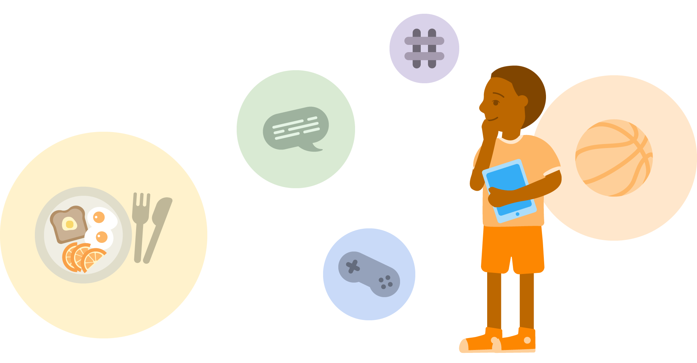
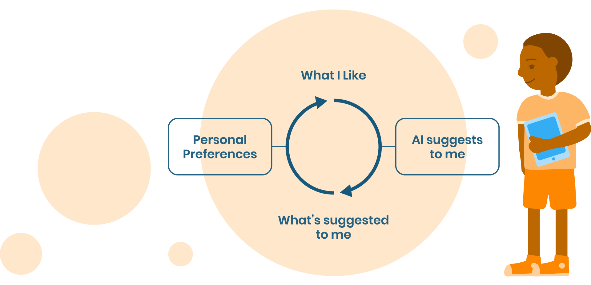

# AI & Ethics

Create a safe space for your students to share about experiences and online habits and their experiences with the AI they encounter online

**Recommended grade level:** 4-8

**Recommended duration:** 15 min

**Learning objectives:** 
* Identify AI in students’ own lives.
* Reflect on their digital habits and how they are influenced by AI and recommendation algorithms.

**Materials:** Facilitator computer with smartboard/projector/monitor.

## AI systems you know
> An introduction to where and why AI is used by online platforms

**Do you know other online platforms that use AI?** 

* Do you know other online platforms that use AI? 
* Did you know that Youtube, Instagram, netflix use AI?  
* AI are learning from example, from input data. What “examples” or “input data” could it be using on the platforms mentioned previously?

> These AIs are using your preferences to be trained. Every time you watch a video or do a search in a search bar, this data is stored. 

**Why?**

**1.** So that you can access more interesting content.

**2.** These platforms also want you spend more time on the platforms.

This comes with 2 side effects:
* You are always looking at the same things because the AI will always recommend similar content to what you were researching - that is what is called a preference bubble.
* Also, you will spend more time than you would want to on the platform

## Knowing your Bubble

**Ask the class what they are looking at online and what youtube/instagram recommends for them.** 

    Note: 
    * They are all the same age in the same class.
    * Living in the same town but youtube/instagram recommends 
    * different content because they have different preferences.

## Reflection
**Knowing your bubble gives you the power to:**  

* Take a step back - Are you always looking at the same kind of video, photos clicking on similar links?
* Check your emotions - Once you are online looking at things how long do you want to stay ? is it what you want to be doing?
* Curate your content  - expand your bubble talk to your friends, you parents, your teachers about what you look at and get suggestions about what they like to look at 

* **You train the AI! Expand your bubble!**

