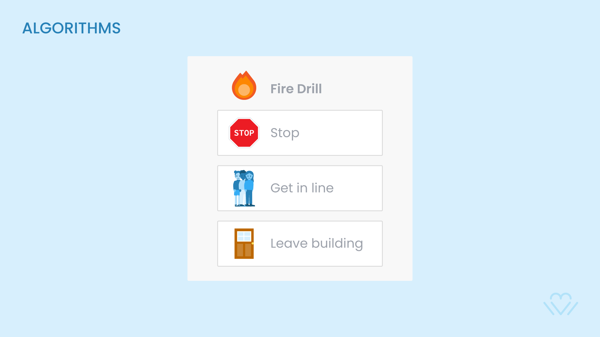
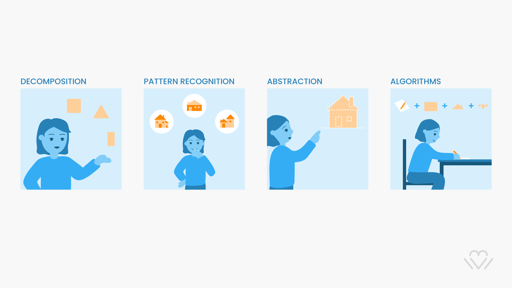

# CT Intro

## Definition
> The thinking we do when we formulate something - like a problem or creative work - clearly enough and systematically enough that we could tell a computer - or a human - how to do it.

    TEACHERS
    * CT comes from classical philosophy
    * How the human mind think and finds solutions to problems?
    * The 4 Pillars are in no specific order

## Decomposition
> To reduce a complex problem into more simple pieces

    TEACHERS
    * Use the path of least resistance
    * Start with what you know, the rest will unfold naturally
    * Do not try to solve 'everything' at the same time

## Pattern Recognition
> To learn how to identify what is similar to: simplify, reduce and apply similar solutions to problems

    TEACHERS
    * What it’s been repeated several times in this sequence?
    * Allows us to simplify the problem into a more precise one
    * Gives birth to language through an agreement
    * Connected to MEMORY: Without it, we cannot recognize anything

## Abstraction
> To reduce something complex to the most essential useful characteristics

    TEACHERS
    * The least obvious of all of them
    * To find what is fundamental takes time and effort
    * Only practice makes you better at what is essential in something
    * It’s today’s data
    * Fundamental for AI

## Algorithms
> A step by step list or sequence of instructions

    TEACHERS
    * The world of recipes, lists and daily actions
    * We all live in our ‘daily algorithm’
    * Slowly we make algorithms better and better

## House Example

    TEACHERS
    * How would you explain to your class CT in a simple way? 
    * Using'drawing'you can include all your students o learn CT

## Text Challenge 
> If today is Friday,what is the day after the day before the day before tomorrow?

    TEACHERS
    * Apply the 4 CT Pillars to find the solution
    * Explain your experience problem solving this question

## Students Table CT?
> Computational Thinking is the toolset we use when we translate our human ideas into precise instructions for a computer to carry  out. Those instructions are called **CODE**.

Observe this table with attention and answer the following questions:

    TEACHERS
    * Which students are doing well? Improving? Sliding?
    * Which test was the whole group well prepared/not well prepared for?
    * Which CT elements would you use to find an answer?

## CT to Code
> Computational Thinking is the toolset we use when we translate our human ideas into precise instructions for a computer to carry  out. Those instructions are called **CODE**.

    TEACHERS
    * Modern computers replaced the old - group of women matemathicians-
    * Grace Hopper - Room of Parabolic Calculations - COBOL
    * The Art of giving instructions has become a powerfull skill

## Papert to Scratch

> The role of the teacher is to create the conditions of inventiveness rather than providing ready-made answers.

    TEACHERS
    * Seymour Papert - a Jean Piaget alumnae - invented first LOGO
    * LOGO is a programming language to teach kids about MATH
    * Later, one of his students Mitchel Resnick created Scratch
    * Scratch is today’s standard to teach kids and adults how to code

