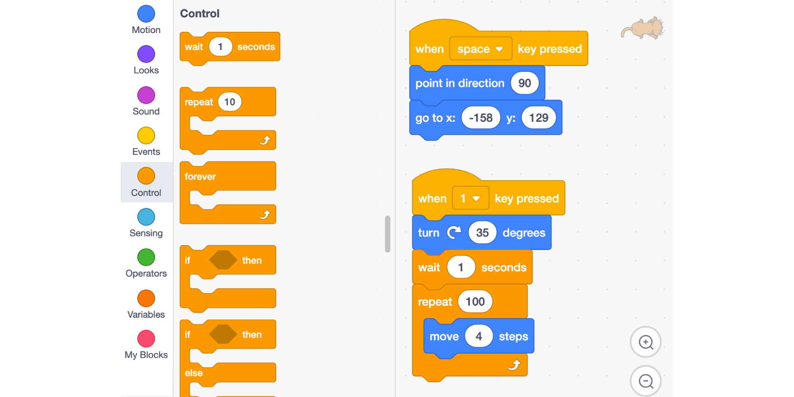
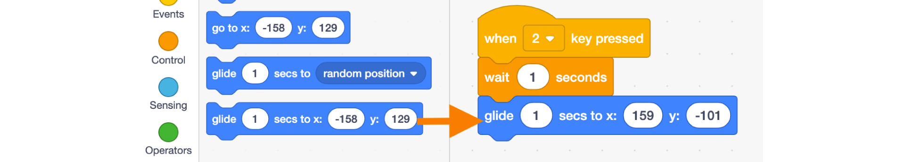

# Scratch Intro

Scratch is a programming language that allows you to use code blocks to create animations, stories, musical instruments, games, and much more. It's a bit like programming using Lego!

**EDITOR**

**TEACHER ACCOUNT:** [Creating a Scratch Account](https://scratch.mit.edu/educators/#teacher-accounts)

> To request an account as a teacher you will have to fill the following form and wait for 24h.

**EDUCATORS FAQ:** [Scratch FAQ](https://scratch.mit.edu/educators/faq)

## How to move in Scratch?

**Recommended grade level:**: grades 5 - 7

**Recommended duration:**: 30 min.

**Learning Objectives:**
* Learn how to move using the centric system - like a GPS -.
* Learn how to move using the cartesian system - x,y coordinates -.

**Materials:**: Scratch 3.0 platform

## Starting point
##### The first thing to do is to define your starting point:  We choose the top left side of the screen.

**1.** From the **event** section, drag an **event block** to trigger your action. Ex: **When ‘space’ key is pressed**

**2.** Move your sprite in the top left corner of the stage.  Drag a **go to x: y:** block and a **point in direction 90** block and attach them to your code

    NOTES
    * 0,0 is the center of the screen.
    * The scene dimensions are: -240 +240 on x and -180 +180 on y

**3.** **Choose a new sprite** the library and place it in the bottom right corner.

##### Clicking over the cat icon you can choose a new sprite, a ball in the example. 

    SPEKAER NOTES
    * Present the different parts of the scratch interface 
    * Present the drag and drop and how to delete a block
    * Explain how the x,y grid works in Scratch - (-240+240, -180+180)
    * Use the Rotation wheel to show properly how angles work in Scratch
    * Explain When key is pressed block show all the possibilities
    * Explain why the code is only added to the sprite when it is selected

## Centric moving
> Using the move, turn and repeat to reach your goal. 

##### We will use the event number 1 to activate the centric movement

**1.** Make sure the cat is **selected**, from the **event** section drag an event block. Ex **When 1 key is pressed**

**2.** From the move section,  drag a **turn block** and adjust it to **35 degrees** so the cat aim towards the ball

##### Make sure you have your sprite selected before starting to code

    NOTES
    *  we could also use the block point towards to select the beachball 

**3.** From the **Motion** section use move “1” step block. you can adjust the length of the movement by increasing the number of steps or use a repetition block from the control section. 

**4.** From the Control section use a **wait** block to give some ‘timing’ to the animation so we can see all the steps. 

##### The block wait helps us to give timing to the code.

    SPEAKER NOTES
    * Show the “turn 35” or point toward blocks
    * Advancing 400 steps vs using a repetition block
    * Explain why we use a wait block between blocks

## Cartesian moving
> Use the cartesian coordinates to move.  Use a condition to react when a color is touched.

##### We will use the event number 2 to trigger the cartesian movement

**1.** From the **event** section drag an event block. Ex **when 2 key is pressed**

**2.** From the **motion** section, use the **glide** block. It allows us to define the point in space (x,y) where we want to go to and also how much time it will take to arrive there. Enter the coordinate of the **beach ball** in the block as a destination

##### Use the glide block from the move section

**3.** From the **control** section, use the **if/then** block, it allows to allow us to check if a condition is met.

**4.**  **Say ‘Hello World” when the cat touches the ball** - From the **sensing** section drag a touching color clock and insert it in the conditional block. 

##### Use the touching color block under the Sensing section

**5.** Click on the **color** inside the **touching color block**, use the **color picker tool** to select the color red from the beachball. The statement now becomes **if the cat is ‘touching the red color is true’ then**.

##### Use the color picker to select the color you want to react from

**6.** From the **looks** section, drag a **Say** block and insert it in the **if/then** block the text to be “Hello World!”

##### Enjoy the final result: Hello World!

    SPEAKER NOTES
    * Explain the glide block, and how to get the beachball coordinate
    * Show what happens when we change the starting point
    * Spend time explaining the condition with a true statement

## Reflection
* Do you understand properly the two distinct ways to move in Scratch?
* Why would you choose one over the other and when?

## Remix
* [Remix this exercise to start: ](https://scratch.mit.edu/projects/325327677/editor/)
* [Scratch Studio](https://scratch.mit.edu/studios/25104660/)

