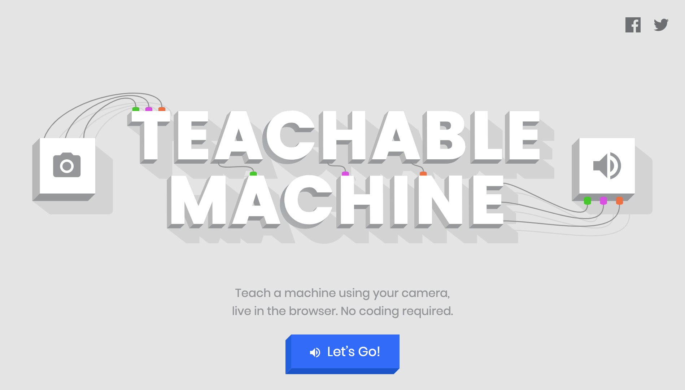
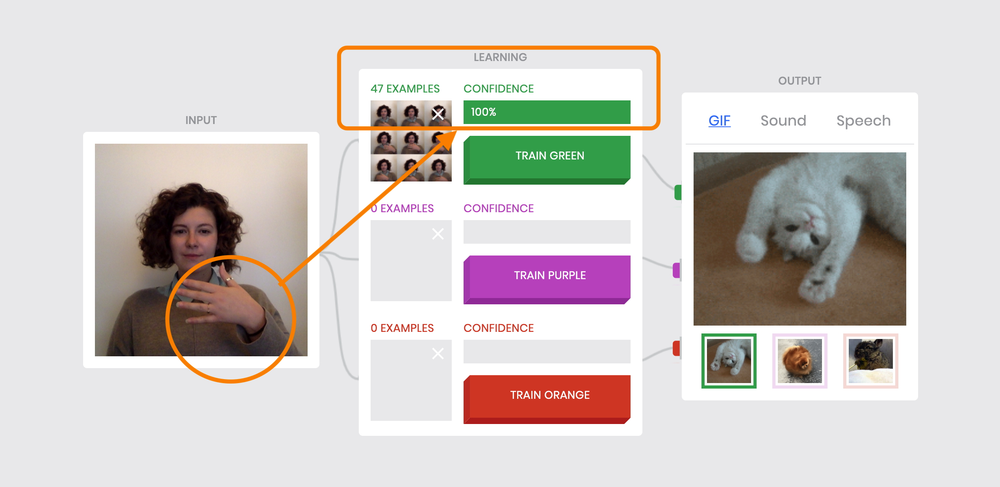
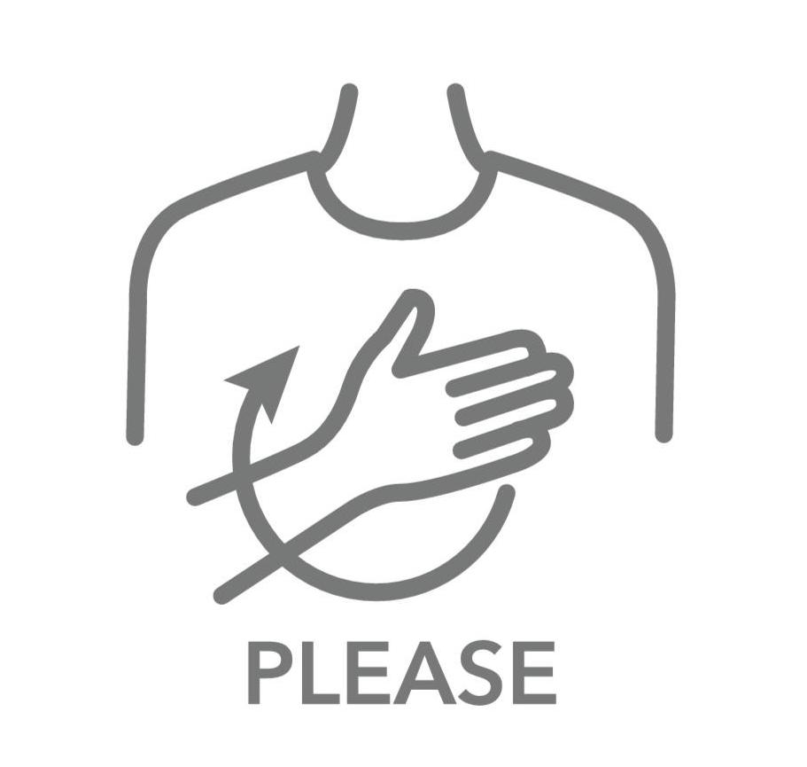
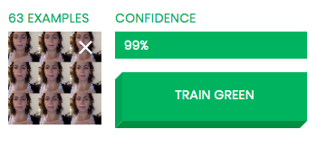
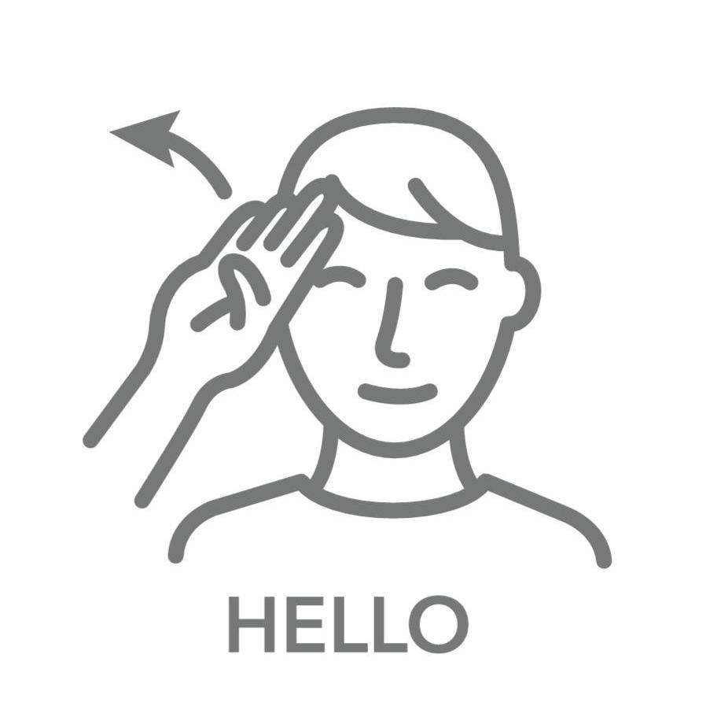
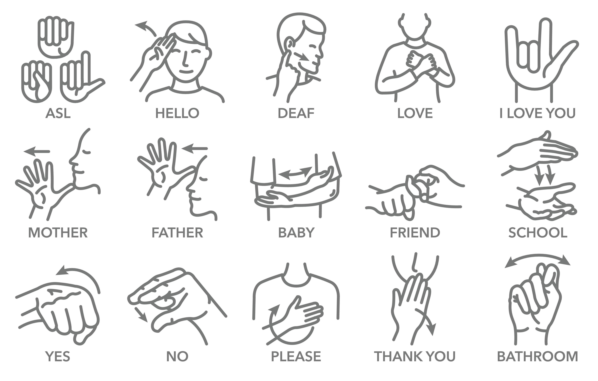

# AI Computer Vision

**Learning Objectives:**
* Familiarity with the concepts of AI, training process, training data and confidence level.

* Familiarity with computational thinking concepts like decomposition, abstraction and pattern recognition in the context of AI.

* Ability to reframe a problem in a way that it can be solved using AI.

**Recommended duration:**: 30 min

**Materials:**: 

* Facilitator computer with smartboard/projector/monitor
* Internet connection + Google Chrome + Webcam
* Student computers, one for every two students
* [Access to The Teachable Machine](https://teachablemachine.withgoogle.com/)

## Part 1: Computer vision

##### The Teachable Machine landing page

##### The Teachable Machine interface

* Train model to recognize gestures. The result of that training will be displayed by a GIF. 
* For the first category sign “please” by pressing and holding the train green button. It will add photos of you (training data) in the green category

##### Sign for please while pressing the train green button

        NOTE
        50 examples per category is enough to train this model.

**Train 3 categories**

> **GREEN:** the sign for please 

> **PURPLE:** the sign for hello 

> **ORANGE:** standing still - no movements

**Extension** 

You can try training the Machine with these other sign

You can try to change the background by rotating your computer 45° on the right or the left and see if the training still works
You can also try having someone do the signs in front of the camera and see if it still works 

**Reflection**

> Why one category is just about standing still? 

In order to recognize signing gestures, the machine has to understand standing still. This is what you are doing by training the orange category.

> What is confidence? 

The confidence level is the AI sharing with us the confidence it has in its decision (exactly like when asked “are you sure?”). 0% is not sure at all, 50% is chance level meaning it is choosing randomly, 100% means it is really sure. 

        NOTE
        Sometimes the AI makes the wrong choice 
        (misidentifying the sign you are making) 
        but it is not very confident of its decision, 
        so we can’t really trust it in that situation