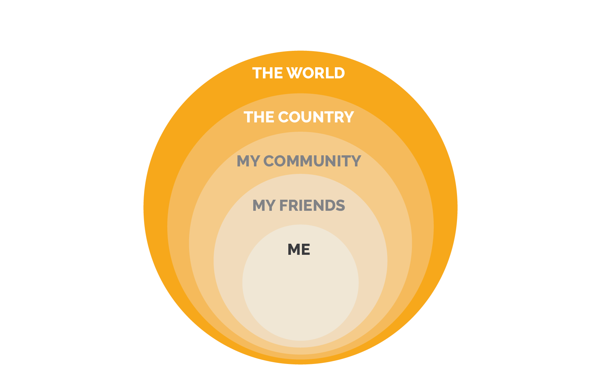
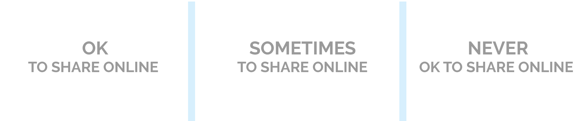
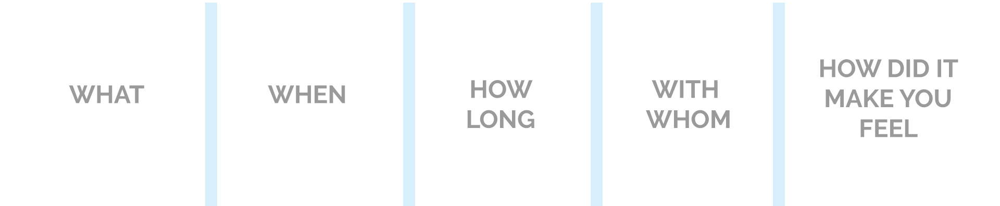

# AI Digital citizenship INTERMEDIATE
 
* These lessons are designed to help students develop safe online habits, maintain a healthy relationship with their screen time and protect their digital privacy.

* Each lesson starts with a short class discussion to introduce the key concepts of AI. These activities can be done offline. The lesson ends with a short wrap-up discussion.

* Lessons are independent from one another and can be done over the course of a few days or a few weeks (i.e one activity per week).

[LINK TO PDF](/assets/images/pdf/AI.pdf)

## Create a safe password

**Learning Objectives:**
* Understand what a password is and why it is important
* Learn how to create a strong password and store it properly
* Explain how AI can guess passwords, and how to make a strong password, that is AI-proof.

**Recommended duration:** 30 min

**Materials:** Computer or a pen and paper

**Theme:** Security online 

**Warm-up discussion**

> **Ask:** What personal information should be kept private?

Students can work in pairs or brainstorm alone. Facilitate a group discussion to hear what the students came up with. Some examples could include: conversations with your friends, your diary, your phone number, your home address.

**Explain:**  One way of protecting information is by restricting who can access it.

> **Ask:** Think about a phone or computer that contains private information or conversations. How do you limit who can access it?

**Explain:** One of the most common ways to protect your personal information online is by using a password. It is a string of letters, numbers, and symbols that allows access to your online information, like emails. Some passwords are stronger than others, because they are harder for an AI to figure out.

**Activity**

> This activity can be done on a computer in an electronic document or offline using pen and paper.

**1.** Pick an animal, a number and a special character (* _ # - &) e.g., 2, horse and *

**2.** Create a very sCreate a very simple sentence containing the animal and the number e.g., 2 horses eat chips

**3.** Capitalize the first letter of your sentence e.g., 2 Horses eat chips

**4.** Replace some of the spaces in your sentence with your special character e.g., 2*Horseseatchips

**5.** Memorize your password by repeating it a few times and writing it down on some paper, or on a computer

**Reflection**
> Ask: Who should have access to your password?

Just yourself? Your parents? Your teachers?

<strong>Notes</strong>
	<ul>
	        <li>To store it memorize it, don’t write it on the same paper as your email or login and the platform it is used for.</li>
	</ul>

**Explain:** As you get older, having a strong password will become even more important. You will use it to protect your bank accounts, email, online profiles, student account, etc.

**Reference**
This activity is inspired by the “Password power-up” activity from [Common Sense Media:](http://bit.ly/2LGPKNn)

## Circle of privacy

**Learning Objectives:**
* Familiarity with the concepts of keeping your personal information safe  from others.
* Understand the importance of personal information and privacy settings online for yourself and others

**Recommended duration:** 30 min

**Materials:** Computer or a pen and paper

**Theme:** Private vs. Personal information

**Warm-up discussion:**

> **Ask:** Have you ever seen photos of you or one of your friends online? If so, where? Have you shared pictures or video online? On what platform? Have you ever had someone share a picture of you without your permission? How did you feel about that?

<strong>Notes</strong>
	<ul>
	        <li>it is important to create a safe space for your students to be able to share their experiences</li>
	</ul>

**Activity**

> Draw 5 concentric circles on the white board, and label them as below:

Ask the class to place each sentence in the circle that they believe represents who can access this information:

* A picture or a video on my phone
* A picture in the local paper
* A video on national television
* A video on a private YouTube channel/ Instagram account
* A video on a public YouTube channel/instagram account

**Reflection**

Online accounts can be private or public. When using ‘private’ settings, you can control who sees what you share. Be mindful of the fact that accounts are usually set to be public by default, and it is up to you to modify your privacy settings.

Also when you post something online, there is a chance that it will never disappear. You might be ok with sharing something today, but you might not feel the same way in the future.

## Private vs. personal information

**Learning Objectives:**
* Develop familiarity with the concepts of private information and why it is important to keep it private
* Learn to respect other people's privacy online when sharing content

**Materials:** Whiteboard

**Theme:** Security online 

**Warm-up discussion**

>  **Ask:** what is the difference between personal and private information? 

Ask students to brainstorm some examples of personal and private information, and then ask them to share with the class.

Examples of personal information include: your tastes, the food you like, your hobbies.

Examples of private information includes: your home address, full name, phone number and anything that could identify you personally.

**Activity**
> Draw 3 columns on the board:

<!--  -->

| OK TO SHARE ONLINE | SOMETIMES OK TO SHARE ONLINE | NEVER OK TO SHARE  ONLINE |
|--------------------|---------------------------|--------------------------|

Ask students to place each of the following pieces of information in the appropriate column:

* Home address - never ok
* Full name - never ok
* Date of birth - never ok
* Passwords - never ok
* Email address - sometimes ok (share it with someone you can trust)
* Phone number - never ok
* What I like to eat - ok to share online
* Cool vacation picture - ok to share online
* The picture or video of my friends - sometimes ok (if you ask their permission)

**Reflection**

Apps and websites will sometimes ask for your private information, like your date of birth and your full name, for advertisement purposes. They do this so they can target certain adverts for products that you might be interested in, so they can ultimately sell more products to you. (e.g., sending you a special discount offer on your birthday)

While chatting with strangers online and in real life, it is important to keep sensitive information private. Otherwise they might be able to trick you or put you in uncomfortable situations (like coming to your home uninvited).

## Screen time diary

**Learning Objectives:**
* Reflect on screen time and online habits
* Develop healthy habits and strategies around screen time management

**Materials:** Computer or a pen and paper

**Theme:** Healthy online habits 

**Warm-up discussion**

> Have you ever kept a diary? What do you do after school? Have you ever thought about how much time you spend online each day?

<strong>Notes</strong>
	<ul>
	        <li>it is important to create a safe space for your students to share their experiences</li>
	</ul>

**Activity**

Ask students to reproduce these 5 columns on their paper, and log all activities in front of a screen for a week or month, including activities done at school:

<!--  -->

| WHAT | WHEN | HOW LONG | WITH WHOM | HOW DID IT MAKE YOU FEEL |
|------|------|----------|-----------|--------------------------|

Explain each column: 

* What: what were you doing? (watching a video, watching TV, playing a video game)
* When: when was it ? (after school, before dinner, after dinner)
* How long: how much time? (20 minutes )
* With whom: who were you with (your parents, your sister, brother, friends, alone)
* How did it make you feel: watching a funny cat videos can make you feel happy but playing video games can make you * feel frustrated.

**Reflection** 

It is important to take a step back and check your emotions when engaging with technology because a lot of these platforms are designed to capture our attention, and it is very easy to get lost in them and spend more time online than we would like.

e.g., Are you watching YouTube because you feel sad and want a good laugh? Do you want to relax by playing a video game that gives you a fun challenge?

Timing yourself and checking your emotions are two great strategies to make sure you are not missing out on other parts of your life, and getting the most out of your online experience.

**Reference**
For more information on digital citizenship and other ideas of exciting activities to do with your class, check out [Common Sense Media](https://www.commonsense.org/education/digital-citizenship/curriculum)