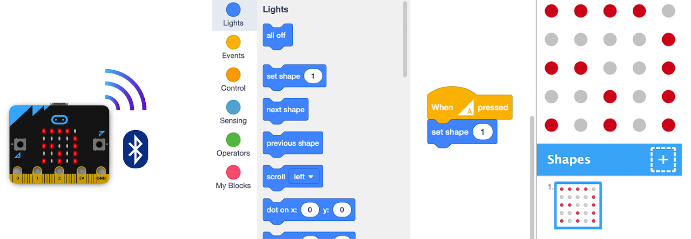
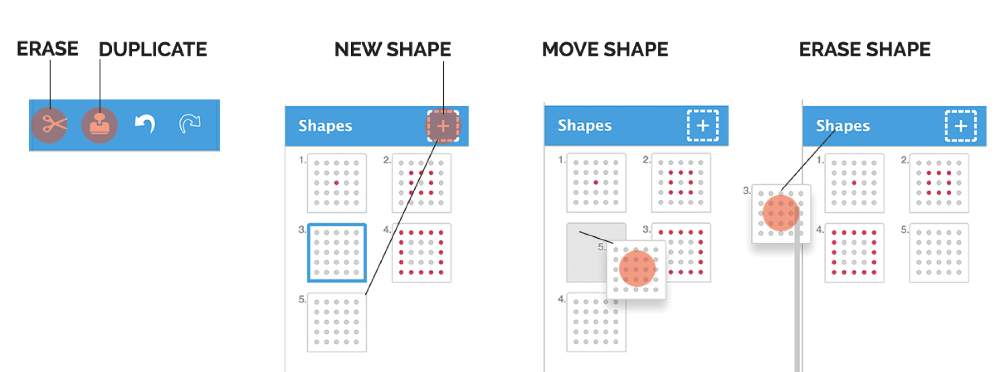
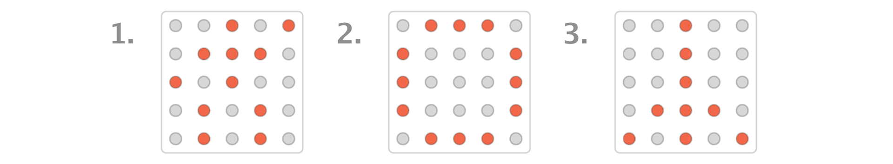
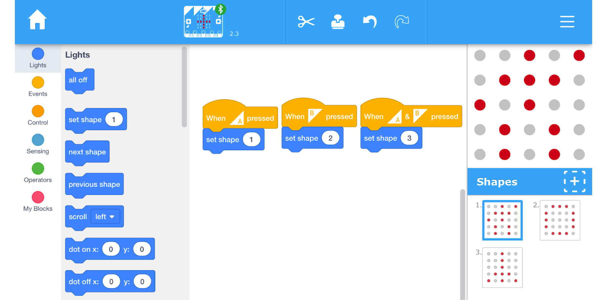
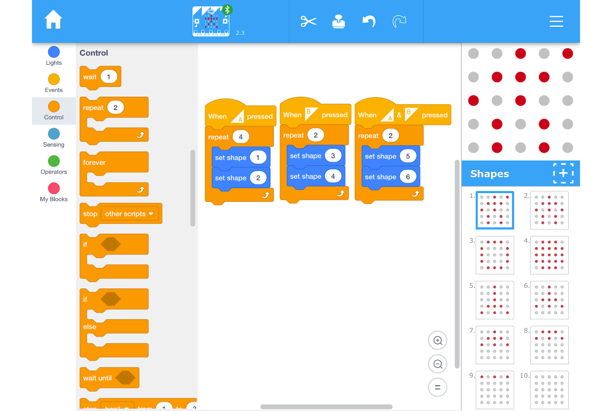
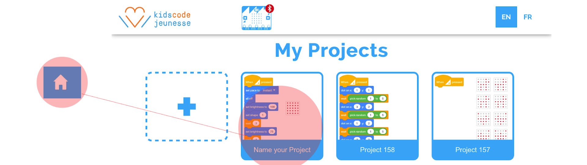

## Artbit Storytelling
> Storytelling with code

**Learning Objectives:**
* Familiarity with physical computing through microbit 
* Familiarity with the different components of a story
* Familiarity with programming concepts: sequences and loops
* Familiarity with computational practices: planning and experimentation

**Recommended grade level:**: grades 3 - 7

**Recommended duration:**: 45 min

**Materials:**

* iPads 
* [art:bit app installed](https://apps.apple.com/ca/app/art-bit/id1444361438)
* [micro:bits with hex file installed](https://kidscodejeunesse.org/artbit.ios/pairing-demo)
* Smartboard/projector/monitor to show the code
* Ipad connector to VGA
* Graph paper
* Pencils

## Introduction

#### Microbit properly connected with the Art:bit via Bluetooth

The Artbit is a simplified version of the MakeCode platform specially created for story-telling and art. It interacts with Micro:bit via Bluetooth without using a simulator. Simply draw your shapes on the right side of the screen (shape section), select it and it will be displayed automatically on your Micro:bit. Creative possibilities are endless!

**The Shape section**

Here is how to create, erase, move and duplicate shapes in the art:bit interface. 

## Storytelling with Shapes
>Three-shape story : Introduction to digital story-telling.

1. In the shape section: Draw three shapes. Ex: A person, the moon, and a rocket

2. Invent a story incorporating these three shapes. Ex when I was young, I dreamed of being an astronaut to travel to the moon.

        NOTES
        With your students, you can introduce this activity by using three 5x5 grid cards to create their shapes and stories 

## Code your story
> Digitize the three-shape story.

From the **Event** section, drag three different events to trigger each shape (when A, B, and A&B pressed).
From the **Light** section add **set shape** blocks to your event blocks and change the number of the shape accordingly 
Trigger your story by pressing the buttons

## Randomize yout story
> Shake up the story with randomization.

Remove the code under the **when A pressed** block.

From the **light** section drag a **set shape** block and from the operator section drag a **comparison** block with an **equal** sign and insert it into the set shape block

## Animate each shape
> Turn each shape into a looped animation.

**To go from a single shape to a two-shape animated sequence.**

> Create the shapes: 

**1.** Duplicate shape 1 (person) using the stamp tool and place it side by side with the first shape 

**2.** Repeat for shape 2 and 3 

**3.** Edit it the copies of the first set of shapes to create an animation

> Create the code:

**1.** From the **control** section, drag a **Repeat** block and place it over the set shape block and set the desired number of repetitions, underneath the When A pressed 

**2.** From the light section drag a set shape block place it in the repeat block and change the shape number to create an animation

**3.** Repeat for the other 2 **Event** blocks

## Save your story 

        NOTE
        All projects are stored automatically to access them click on the house icon This is where all of the projects on this device are stored.

#### Double click over the text to name your project

## Activity Ideas

* **Download our free activity cards to create your first art:bit animation in minutes!**
> [Get Cards](https://kidscodejeunesse.org/artbit.ios/data/artbit_activity_deck.pdf)

