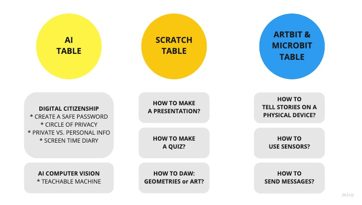

# Explorations

**Introduction**

Explorations is a chance to explore short activities and give you a chance to discuss how these skills could be brought into your classroom.
Use the time to discuss with your peers and keep in mind that you will need to fill out a document at the end to indicate how the connections might be made in your specific teaching context.

**Inspiration**

<video width="100%" height="" controls>
    <source src="/assets/images/videos/INSP.mp4" type="video/mp4">
</video>

## Groups Form
* [Fill the form](https://training.kidscodejeunesse.org/Forms/)

## Table System
> You will be divided into:

**Grade Groups**
* Primary K-2
* Junior 3-6
* Intermediate 7 8
* Secondary 9-12

**Choice of Interest** 
> **You can choose 2 activities of 45 min each**

**Experience level**
* Comfort Level 1
* Comfort Level 2
* Comfort Level 3

## Presentations

* At the end of the day one person per table will share what they have learned and the connections made with their school curriculum.

* All the results will be shared with all the assistants through the Google Drive so they can see and learn from each other.

* [LINK TO TABLE PRESENTATIONS](https://docs.google.com/document/d/14RZRflq1zC4FCBXam_kCOyZjY10uCIn95P6xQ4Ki98o/edit?usp=sharing)