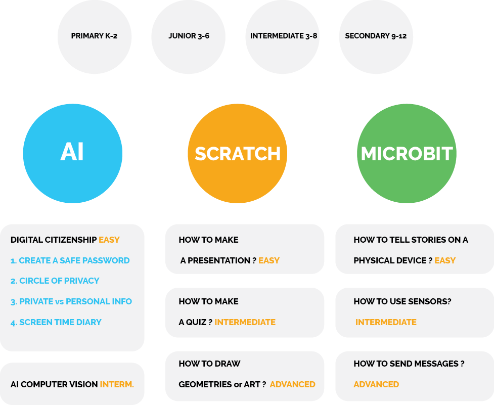

# Explorations

## Introduction

* **Find your group** and start brainstorming ideas around Scratch, AI or Micro:bit. 

* **Explore our short activities** and start thinking about project ideas for your classroom. 

* With your peers, you can **discuss how the technology you have just discovered can fit in your teaching**. 

* **Fill out a note document** a chance to present your discoveries to your peers in a **short pitch.**

## Groups-Maker
* [Fill the Groups Making Form](https://docs.google.com/forms/d/e/1FAIpQLSeG3m9RVwkgDhGLpNsp9y_wj1J2FCwdih_YcThjlXBbBgaviw/viewform)

**Inspiration**

A video of a class created projects using technology  around the [UN global goals](https://www.globalgoals.org/)

<video width="100%" height="" controls>
    <source src="/assets/images/videos/INSP.mp4" type="video/mp4">
</video>

## Explorations
> **2 Activities - 45 min each**

In each group select one person to take notes:

* Find **table number** and open the **corresponding document:**
* [PRESENTATIONS NOTES](https://drive.google.com/drive/folders/1V5kWtV8vPmYO2uAkd5l7rL5bU9Z0gZ64?usp=sharing)
* Because the notes are captured on a drive you will be able to access other groups ideas 

## Presentations

This is the time to share the essence of your project ideas and new encounters with the rest of the group … in 3 min :)