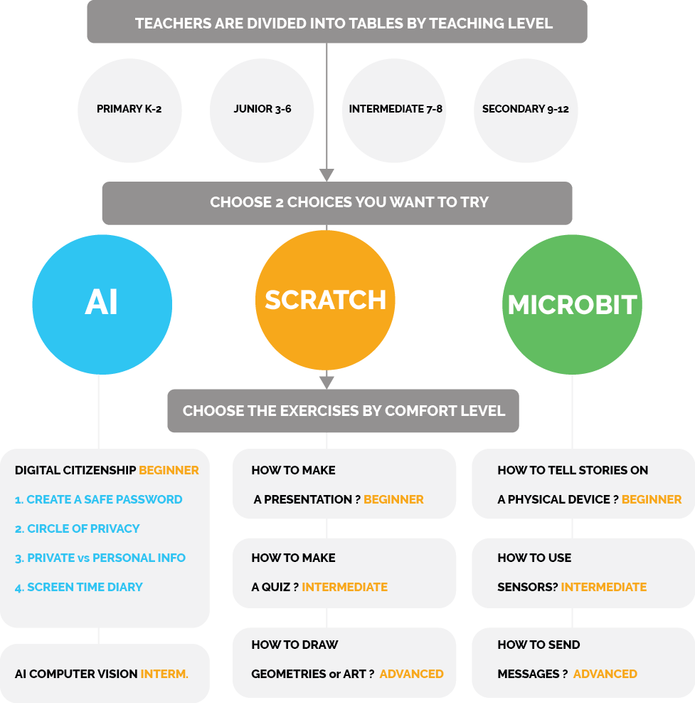

# Exploration Stations

## Introduction

* **Explore our short activities** found on the left side of this page. As you go through the activities, start thinking about how you could incorporate these into your classroom.

* With the teachers at your table, **share ideas around how you could use Scratch, AI, or micro:bit to enhance your students' learning.**

* **Don’t forget to fill out the [note document](https://drive.google.com/drive/folders/17iS_xCMzZx_fVneUcsTA8pOvQ0E7zPWR?usp=sharing)**.

* Present your discoveries to your peers in a **short pitch.**

**Inspiration**

This group of students used innovation to support the UN Global Goals through innovative projects using various technologies and building prototypes!

[UN global goals](https://www.globalgoals.org/)

<video width="100%" height="" controls>
    <source src="/assets/images/videos/INSP.mp4" type="video/mp4">
</video>

## Explorations
> **2 Activities - 45 min each**

Select one person to take notes on your group discussion. We have already created note documents for you, you can find it here: [note documents](https://drive.google.com/drive/folders/17iS_xCMzZx_fVneUcsTA8pOvQ0E7zPWR?usp=sharing)

* Find your **table number** and open the **corresponding document**:
    * [CLICK TO FIND YOUR PRESENTATIONS NOTES](https://drive.google.com/drive/folders/17iS_xCMzZx_fVneUcsTA8pOvQ0E7zPWR?usp=sharing)
* Since the notes are captured on a Shared Drive, you will be able to access other groups’ ideas as we do this workshop with teachers across Canada!

## Presentations

Share the essence of your project ideas with the rest of the group - you only have 2 minutes so keep it succinct! 😃