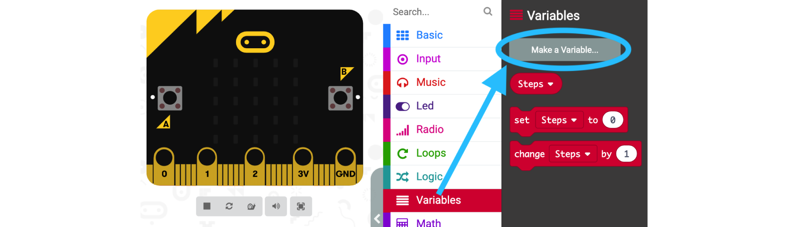
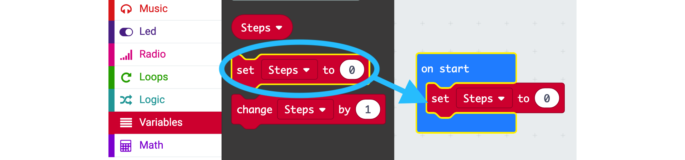
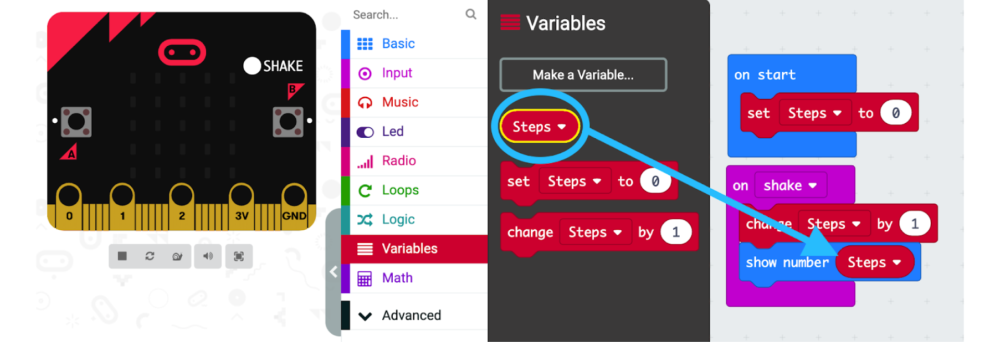
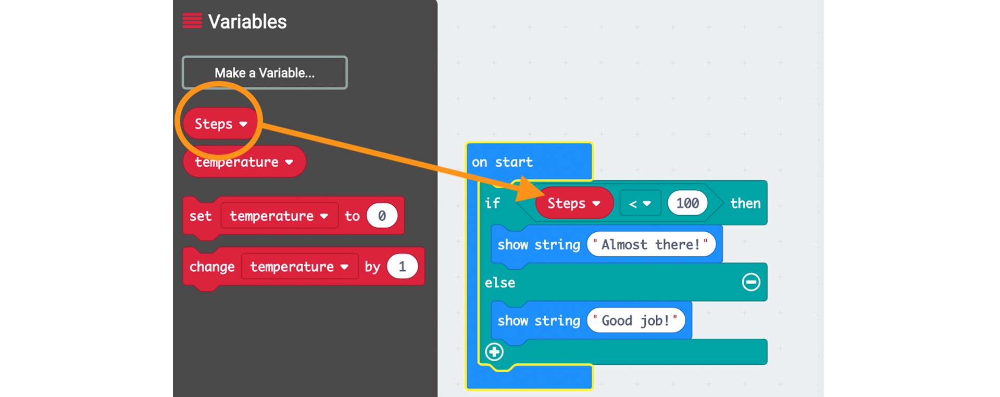
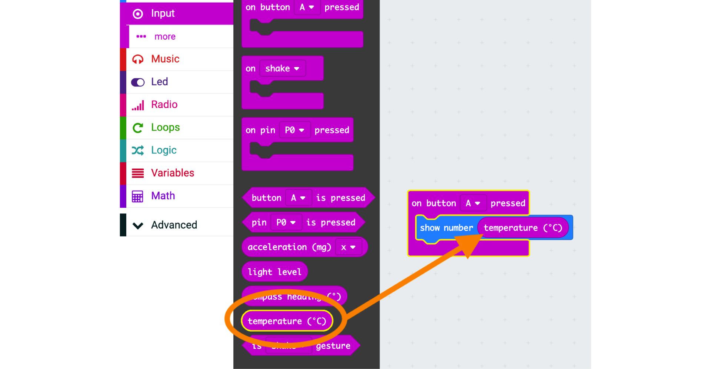
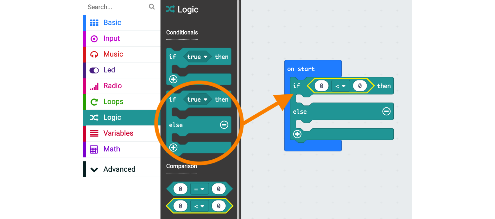
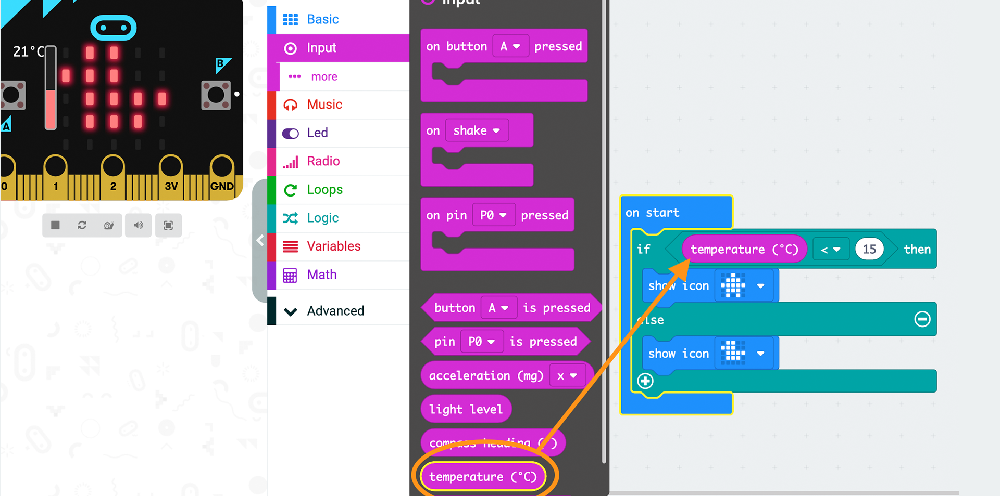

# micro:bit Sensors INTERMEDIATE
> Using sensors data to create your projects

**Learning Objectives:**
* Explore physical computing with the micro:bit
* Explore programming concepts: sequences, repetition, strings, and logic
* Develop familiarity with computational practices: planning and experimentation through the exploration of additional micro:bit features
    * Step counter
    * Thermometer

**Recommended grade level:** grades 5 - 9

**Recommended duration:** 30 min

**Materials:**

* micro:bit
* Computer
* Projector/Monitor/Smartboard

<button style="width: 100%; padding: 20px; cursor: pointer; box-shadow: 6px 6px 5px; #999; -webkit-box-shadow: 2px 6px 5px #999; -moz-box-shadow: 6px 6px 5px #999; font-weight: bold; background: orange; color: white; border-radius: 10px; border: 0px solid #999; font-size: 150%;" onclick=" window.open('https://makecode.microbit.org/','_blank')">START MAKECODE</button>

## Step counter
> Build a step counter

**1.** Delete the two default blocks, **on start** and **forever**, from the coding area.

**2.** **Create a variable** - In the **Variables** section, select **Make a Variable** and name it ‘Steps’.

**3. Initialize your counter**
* From the **Basic** section, drag an **on start** block into the coding area.
* From the **Variables** section, insert the **step to 0** block into the brackets of the **on start** block.

**4.** **Count steps**
* From the **Input** section, drag an **on shake** block into the coding area.
* From the **Variables** section, drag a **change step by 1** block and insert it into the on shake block.
* From the **Basic** section, drag a **show number** block add it below the **change step by 1** block.
* From the **Variables** section, drag a **Steps** block and insert it into the **show number** block.

**Test your code**
* Online: click on the **“SHAKE”** button that appeared on the micro:bit emulator
* Offline: Download your code to the micro:bit and shake it! [LINK]()

### Activity Ideas
* **Scavenger Hunt:** Have your students estimate the number of steps from one clue to the next
* **PE stations with different activities** (10 jumping jacks, 3 burpees, etc.): keep the count with a micro:bit
* **Calorie burn counter:** Multiply each step taken by the number of calories burnt per step

## Extension

**Test whether you have taken 100 steps:**

* From the **Basic** section, drag an **on start** block into the coding area.
* From the **Logic** section, drag an **if “true” then /else** block into the brackets of the **on start** block.
* From the **Logic** section, drag a comparison **less than (<)** block and slide it on top of the opening labeled **true** of the **if “true” then/else** block.
* From the **Variables** section, drag a **Steps** block and insert it on the left side of the **less than (<)** block to replace the ‘0’.
* On the right side of the **less than (<)** block, change ‘0’ by 20 for your test.* 

**Display a reaction to your step count:**

* From the **Basic** section, drag two **show string** blocks into the coding area and insert them into the brackets of an **if “true” then/else** block.
* Change the messages that will be displayed to something that reflects the result of the comparison. Ex. when (Steps < 20) **‘Almost there!’**
* Similarly, from the **Basic** section, you can add the **show icon** or **show LEDs** block and display the image or icon of your choice.

## Thermometer
> Build a thermometer

**1.** From the **Input** section, drag an **on button A pressed** block into the coding area.

**2.** From the **Basic** section, drag a **show number** block into the coding area and insert in the brackets of the **on button A pressed** block.

**3.** **Display the temperature on your micro:bit** - From the **Input** section, drag a **Temperature (°C)** block and insert it in the **show number** block.

## Extension
> Is it hot or cold?

**Test if the temperature is greater than 15°C :**

**1.** From the **Basic** section, drag an **on start** block into the coding area.

**2.** From the **Logic** section, drag the **if “true” then/else** block into the **on start** block.

**3.** From the **Logic** section, drag the comparison **less than (<)** block and insert it where the “true” is in the **if “true” then/else** block.

**4.** From the **Input** section, drag the **Temperature (°C)** block and insert it on the left side of the **less than (<)** block to replace the ‘0’.

**5.** In the **less than (<)** block, change the right hand ‘0’ to 15 for your test.

**Action defined by the recorded temperature:**

* From the **Basic** section, drag either two show icon blocks or two **show LEDs** bocks into the coding area and insert them in the brackets of the **if “true” then/else** block.

* Change the icons or draw the images that will indicate what the result of the comparison is ***Ex. when temperature > 15 display a duck < 15 display a house***

## Challenges

* Can you change the temperature of the microbit with you body/hands? how hot can you make it?

* Can you broadcast the temperature from outside to a micro:bit in the classroom?

* Can you build a project that records the average temperature in your classroom every hour? day?

## Activity Ideas
* **Surface temperatures:** 
> Measure the temperature on black and white surfaces outdoors
* **Introducing climate change:** 
> Compare the temperature measured today with the average temperature over the last decade in your city
* **Projects for children and teens to combine creativity and technology in solutions for the Global Goals**
> [Inspiratons - 7 Projects](https://microbit.org/do-your-bit/inspiration/)
