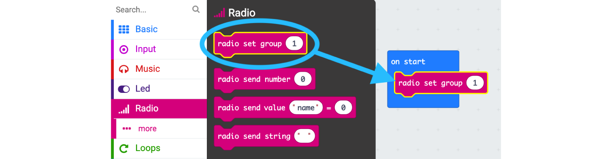
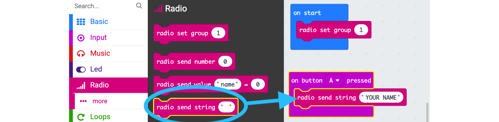

## Microbit Messages
> Experiment with the radio - How to send messages!

**Learning Objectives:**
* Learn how to broadcast simple messages with the micro:bit
* Learn how communication groups or channels work when sending information.

**Recommended grade level:**: grades 5 - 9

**Recommended duration:**: 30 min

**Materials:**

* Micro:bit 
* Computer 
* Projector 

## Broadcast your name
> Using Radio section blocks to send and receive messages between micro:bits.

        NOTES
        * In Makecode radio channels are named groups, 
        everybody within the same group can send and 
        receive messages to each other.

**Sending a message when button A is pressed:**

**1.** From the **Radio** section add a block set radio group to 1 to the **on start** bracket

**2.** From the **Input** section, drag the **on button A pressed** block into the coding area.

**3.** From the **Radio** section, drag the **radio send string** block into the **on button A pressed** block and then type your name in the block.

**To receive a message:**

**1.**  the Radio section, drag the on radio received receivedString  into the coding area.

**2.** From the Basic section, drag the show string block into the coding area. 

**3.** Add a receivedString block by dragging  it from the on radio received block

        NOTES
        * Don’t confuse the on radio received “receivedString” 
        and the on radio received “receivedNumber” block. 

## Download your Program
**1.** Connect your micro:bit to your computer using a USB cable.

**2.** The micro:bit will show up as a drive called **MICROBIT**

**3.** On the Makecode platform, after creating your code, press the **Download** button in order to save your code.
	
<video width="100%" height="" controls>
    <source src="/assets/images/videos/A.mp4" type="video/mp4">
</video>

**4.** Save it as a .hex file, which is a format that the micro:bit can understand.
Locate the downloaded file and drag it to the 'MICROBIT' drive to upload your code to the micro:bit.

<video width="100%" height="" controls>
    <source src="/assets/images/videos/B.mp4" type="video/mp4">
</video>

## Extension 
> Review how a micro:bit can communicate with other micro:bits in the area.

* **If two people want to send messages between themselves (and no one else), how would they adapt their code?**

> Using a different radio group

* Test different kinds of obstacles that can stop or reflect radio waves: try paper, doors, walls and tin foil (radio waves can bounce on tin foil)

 * Measure how far the signal can travel by using a step counter LINK.

## Activity Ideas
* **Inspirational games created around the MB Radio extension**
> [Microbit Radio Games: Ball Pass](https://summer-camp-2019.kidscodejeunesse.org/MB1/)

> [Microbit Radio Games: Shoot and Score](https://summer-camp-2019.kidscodejeunesse.org/MB2/)

> [Microbit Radio Games: Long Pass](https://summer-camp-2019.kidscodejeunesse.org/MB3/)

* **Projetcs for children and teens to combine creativity and technology in solutions for the Global Goals**
> [Inspiratons - 7 Projects](https://microbit.org/do-your-bit/inspiration/)

