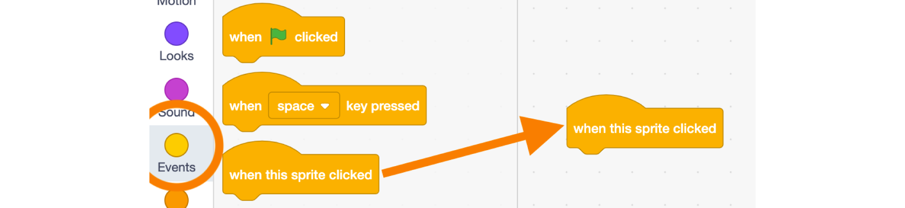

# Scratch Presentation BEGINNER

**Learning Objectives:**
* Create an interactive presentation on a subject of your choice using Scratch. - [GLOBAL GOALS LINK](https://kidscodejeunesse.org/global-goals)
* Introduction to storytelling using Scratch
* Familiarity with the Scratch environment 

**Recommended grade level:**: grades 3 - 9

**Recommended duration:**: 45 min

**Materials:**: Scratch 3.0

**Warm-up**
* If you already have a project you've done with the class, it's a great starting point (ex: arctic tundra, polar bear). - [GET INSPIRATION](http://www.hww.ca/en/ )
* Find some fun and interesting facts that you will then illustrate with characters in your project (ex: Polar bears have translucent hair and black skin to absorb and preserve body heat). - [GET INSPIRATION](http://www.hww.ca/en/)

## Remix
Click on this link to see an example of a project you can remix to make a similar project on the subject of your choice:

* [START HERE](https://scratch.mit.edu/projects/334082831/editor/)

* [SCRATCH STUDIO](https://scratch.mit.edu/studios/25252820/)

## Build from Scratch

* Go to: [SCRATCH](https://scratch.mit.edu/) click on start creating

* **Select a backdrop** - Click **Choose a backdrop** (in the bottom right corner) and pick a scene from the library that fits your project’s theme. ***ex: Arctic landscape***

* **Select a sprite** -  Delete the cat sprite, then click on **Choose a Sprite** (bottom right corner) and pick a sprite that fits with your theme from the library. ***ex: Bear***

* **Make your sprite talk** - From the **Events** section, drag **when this sprite is clicked** block into the coding area.

* Click on the **Looks** section and drag the **Say ‘Hello!’ for ‘2’ seconds** block into the coding area and attach it to the bottom of the **when this sprite is clicked** block.

* Change the text - Type in one of your fun facts! **Ex: My fur is transparent!**

* You are done! Test your code by clicking on your sprite.

## Extension

**Add other sprites** - Reproduce the same code using other sprites that can tell us other facts when they are clicked!  

* **Download an image from the internet and use it as a sprite**

* Use **google image** to look for pictures of other animals or characters (**right-click, save image as**). 

* Use the **Tools** section of the google image search bar to filter pictures by **Usage rights**, select Labeled for reuse
        
        TIP
        Look for images using “white background” as part of your search to find images that will be easier to edit.
        Go back to the Scratch interface, click on the sprite icon and select Upload Sprite 
	

* Go back to the Scratch interface, click on the **sprite icon** and select **Upload Sprite**
	

* Remove the white background:
    * Click on the **Costume tab** on the top left corner of the screen
    * Click on your **sprite**
    * Select the void (empty) fill color
    * Fill the white background with the bucket tool

**Add a title to introduce the project which will disappear when the green flag is clicked**

* **Create your title** - Create a **new sprite** using the **paint** tool 

* Select the **Costumes** tab 	
* Write your title using the **T** tool

* **Animate your  title**
    * Select the **Code** tab,
    * From the **Events** section, drag the block **when green flag is clicked** into the coding area.
    * From the **Looks** section, drag a **Hide** block and connect it to your code
    * From the **Control** section, drag a **Wait for “ 3” seconds** block, connect it to your code and edit the time as required.
    * From the **Looks** section, drag a **show** block and connect it to your existing code.

