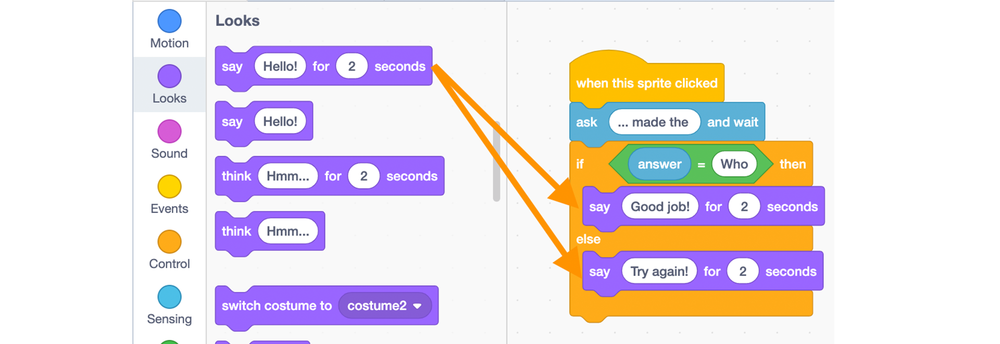

# Scratch Quiz INTERMEDIATE

**Learning Objectives:**
* Develop familiarity with the Scratch environment
* Learn about Logic programming

**Recommended grade level:** Grades 3 - 9

**Recommended duration:** 30 min.

**Materials:** Scratch 3.0

**Warm-up**
* Create a few examples of closed-ended questions you could ask in a quiz - the questions should have only 2 options for the answer.

**Examples** 
> Is Sydney the capital of Australia? yes/no

> Is 8x3 = 25? yes/no

> Who/Whom made that cake?

## Remix
Click on this link to see an example of a project you can remix to make a similar project on the subject of your choice:

<button style="width: 100%; padding: 20px; cursor: pointer; box-shadow: 6px 6px 5px; #999; -webkit-box-shadow: 2px 6px 5px #999; -moz-box-shadow: 6px 6px 5px #999; font-weight: bold; background: orange; color: white; border-radius: 10px; border: 0px solid #999; font-size: 150%;" onclick=" window.open('https://scratch.mit.edu/studios/25252824/','_blank')">SCRATCH & REMIX</button>

## Build from Scratch

* Go to: [SCRATCH](https://scratch.mit.edu/) click on start creating

* **Make your sprite talk** - Click on the **Events** category in the block palette and drag the **when this sprite is clicked** block into the coding area.

* **Ask a question:** From the **Sensing** section, drag the **Ask ‘What is your name’** and **wait** block to the coding area and add it to your code.

* **Add your question** - Double click on the white bubble to select the “What is your name” text and paste in your question.

* From the **Control** section, drag an **if/then/else** block and add it to your code.

**Check the answer:** From the **Operator** section, drag the hexagonal **comparison block with an equal sign** into the coding area and place it inside the blank spot between the “if” and the “then” of the **if/then/else** block.

* From the **Sensing** section, drag the **answer** block and add it in on the left-hand side of the comparison block.

* In the green **comparison** block, on the right-hand side of the equal sign, write one of the two possible answers.
* From the **Looks** section, drag two **say “Hello!” for 2 seconds** blocks into the coding area and place them between the branches of the **if/then/else** block.

* Change the text in the **say** block according to the comparison, for example, **“Good job”** for the correct answer and **“Try again!”** for the incorrect answer

* You are done! Test your code by clicking on your sprite

## Extension

**Add more questions** to your quiz by connecting the same sequence of blocks to your code and changing the question and the associated answer to compare to.

**Change the sprite’s appearance** when the answer is correct.

From the **Look** section, drag the **switch to “costume1"** block and add it to your code.

From the **Look** section, drag the **switch to “costume2”** block into the bracket of the **if/then/else** block that corresponds to the correct answer.
	

* Select your **costume2** variable in the drop-down list by clicking on the **arrow on the side**.

* **Keeping score** - From the **Variables** section, click the **Make a Variable** button and name the variable score.

* Drag the **set my variable to 0** block and attach it to the **when my sprite is clicked** block.

* Select your **score** variable in the drop-down list by clicking on the **arrow** on the right of the variable.

* From the **variables** section, drag two change **“my variable” by “1”** blocks to the coding area. Add one **change “my variable” by “1”** to each of the brackets of the **if/then/else block**. Select your **score** variable in the drop-down list by clicking on the **arrow** on the right of **“my variable”**.

* Update the **change “my score” by “1”** block to change score value to **“1”** for the correct answer and to **“-1”** for the incorrect answer.

