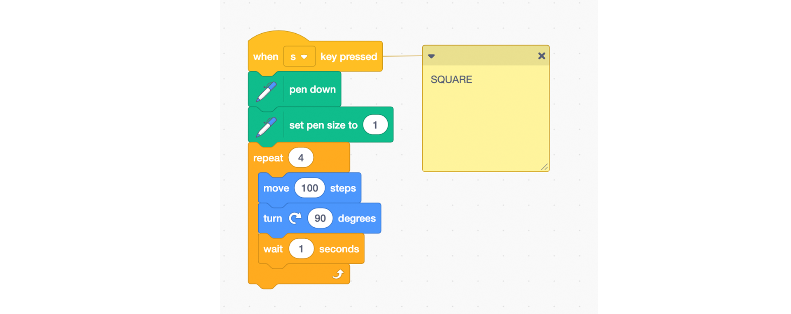

# Scratch Drawing ADVANCED

**Learning Objectives:**
* Develop familiarity with the essential Scratch drawing tools
* Curriculum connections with their Math and/or Art

**Recommended grade level:**: grades 3 - 9

**Recommended duration:**: 45 min.

**Materials:**: Scratch 3.0

## Remix
Click on this link to see an example of a project you can remix to make a similar project on the subject of your choice:

<button style="width: 100%; padding: 20px; cursor: pointer; box-shadow: 6px 6px 5px; #999; -webkit-box-shadow: 2px 6px 5px #999; -moz-box-shadow: 6px 6px 5px #999; font-weight: bold; background: orange; color: white; border-radius: 10px; border: 0px solid #999; font-size: 150%;" onclick=" window.open('https://scratch.mit.edu/studios/25252827/','_blank')">SCRATCH & REMIX</button>

## Build from Scratch

* Go to: [SCRATCH](https://scratch.mit.edu/) click on start creating

## Set up

 **1.** **Choose your sprite** - Choose the sprite you want to draw your shape with from the library (we suggest using an arrow to help visualize changes in direction).

**2.** Click on the lower left-hand corner **extension** symbol

**3.** **Add the drawing extension** - Select the **PEN** extension which makes the **PEN blocks** available at the bottom of your Block palette. 

**4.** **Create a blank canvas** - From **Events**, drag a **when a space is clicked** block in the coding area. From the Pen section, drag an **erase all** block and add it to your code.

**5.** **Define your reset button - clean your canvas before drawing**  - In the Stage section, use your mouse to move your sprite to the position you want to start drawing at. From the **Motion** section, drag the **go-to x: y:** block and the **point in the direction 90** block into the coding area.

## Draw a Square
> Learn how to draw a square

* From the **Events** section, drag the **when ‘space’ key pressed** block into the coding area. Trigger the event by choosing the key from the drop-down menu. ***Ex: When ‘s’ key pressed***

* **Draw one side** - From the **Pen** section, add the **pen down** block to your code 

* From the **Motion** section, drag the **move # steps** block and the **turn #degrees  block** into the coding area. Adjust the number of steps to 200 and the number of degrees to 90.

* **Draw the other sides** - From the **Control** section, drag the **Repeat** block into the coding area and add it around the move and turn block. Adjust the repeat number to draw a square. 

* Your first drawing of a square with code!

## Extension challenge
> Draw a circle or a hexagon

        NOTE
        * You can draw a Mandala by putting an extra loop 
        in the code to repeat drawing the geometric shape. 

### Experiment with other blocks ###

* Change the **color** and **thickness** of your square by using the following blocks in your code:

        NOTE
        * There are 100 colors to choose from
        * To explore what the colors are:
        * Set the pen color to 0 (red)
        * Use a loop to change the pen color by 10 while the sprite is moving: 
        this will give an idea of what the colors are. 

## Drawing machine
> Create a never-ending drawing machine

* **Update your reset button** - In the code of your reset button (erase your canvas),  change the angle of the **point in direction** block so that it is different from 90°. This will allow your machine to something other than a horizontal line.

* From the **Events** section, drag the **when ‘space’ key pressed** block to trigger your action and select the key you want from the drop-down menu.  the  ***Ex: When ‘d’ key pressed.*** 
* From the **Pen** section, drag the **pen down** block into the coding area to start the drawing. 
* From the **Control** section, add the **forever** repetition block to your code so that your machine keeps on going.
* From the **Motion** section, drag the **move 10 steps** block and the **if on edge bounce** block into the coding area and place them both inside the **forever** loop. 

* Change the color of your lines! From the **Pen** section, use the **set pen color** and **change pen color** blocks in your code.

## Random drawing machine
> Make your drawing machine less predictable.

* From the Operators section, drag the pick random block and slide into the turn degree block. Change the numbers in the pick random to from -60 to 60. 

* Let your machine run free and create unique patterns!

