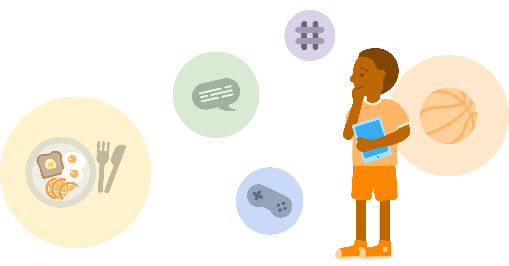
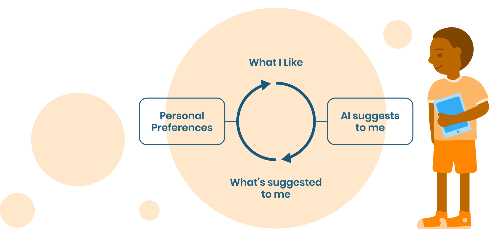

# AI & Ethics

>  It’s important to create a safe space for your students to share their experiences with AI online as well as their online habits.

**Recommended grade level:** 4-8

**Recommended duration:** 15 min

**Learning objectives:** 
* Identify AI in students’ own lives.
* Reflect on their digital habits and how they are influenced by AI and recommendation algorithms.

**Materials:** Facilitator computer with smartboard/projector/monitor.

## AI systems you know
> An introduction to where and why AI is used by online platforms

**Do you know other online platforms that use AI?** 

* Did you know that Youtube and Instagram use AI?

* AI gets “smarter” as more data gets added to its data set. Thinking about YouTube, Instagram or Netflix, what data do you think these systems are gathering from users like ourselves?

> These AIs use your preferences as a training data set. Every time you watch or like a video, or type into a search bar, this data is stored.

**Why?**

**1.** So that you can access more interesting content.

**2.** These platforms also want you spend more time on the platforms.

This comes with 2 side effects:

* You always see the same type of content because the AI will always recommend similar content to what you were researching - this is called a **preference bubble**.

* Also, you may spend more time than you would want to on the platform.

## Knowing your Bubble

**Ask the class what they are looking at online and what YouTube/Instagram recommends for them.** 

<strong>Notes</strong>
	<ul>
		<li>They are all the same age in the same class.</li>
        <li>Living in the same town but youtube/instagram recommendations are different.</li>
	</ul>

## Reflection

> Are you always looking at the same kind of videos and photos or clicking on similar links?

**Knowing your preference bubble gives you the power to:**  

* Check your emotions - Once you are online looking at things how long do you want to stay? Is it what you want to be doing with your free time?

* Curate your content - talk to your friends, your parents, your teachers about what you look at, and get suggestions about what they like. 

* **You train the AI! Expand your bubble!**

[We deeply recommend to watch this inspirational TED TALK video](http://www.evolvingai.org/fooling)
