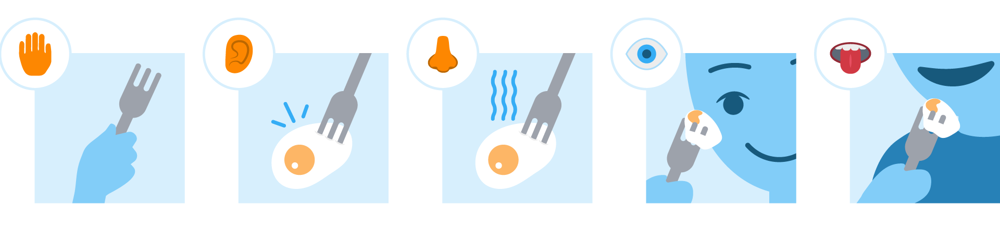
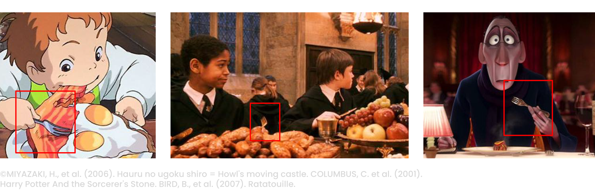
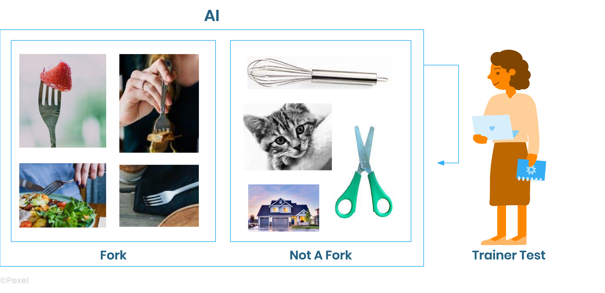
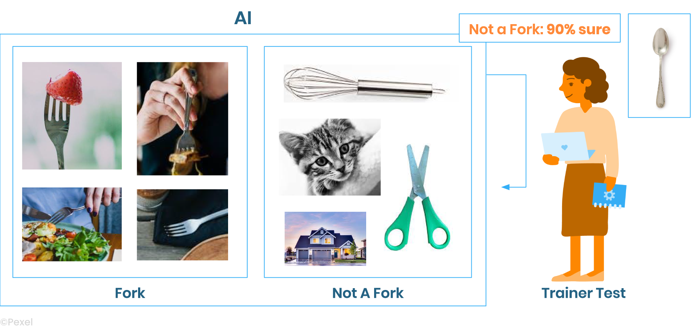
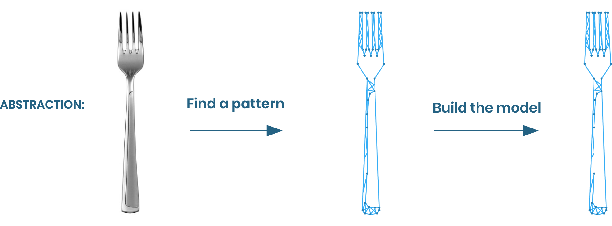
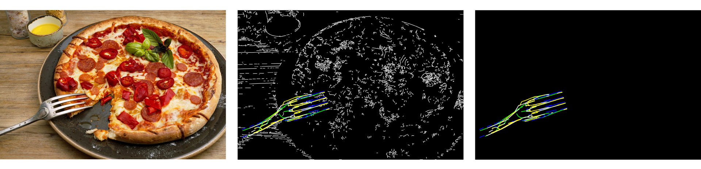
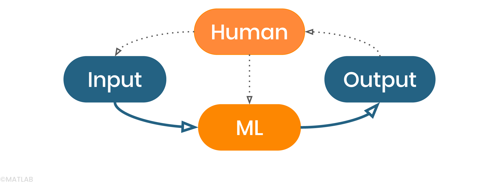
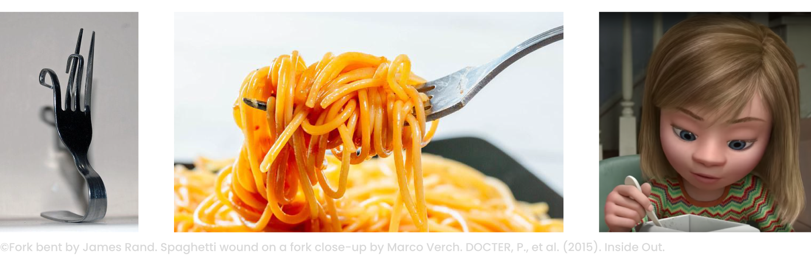
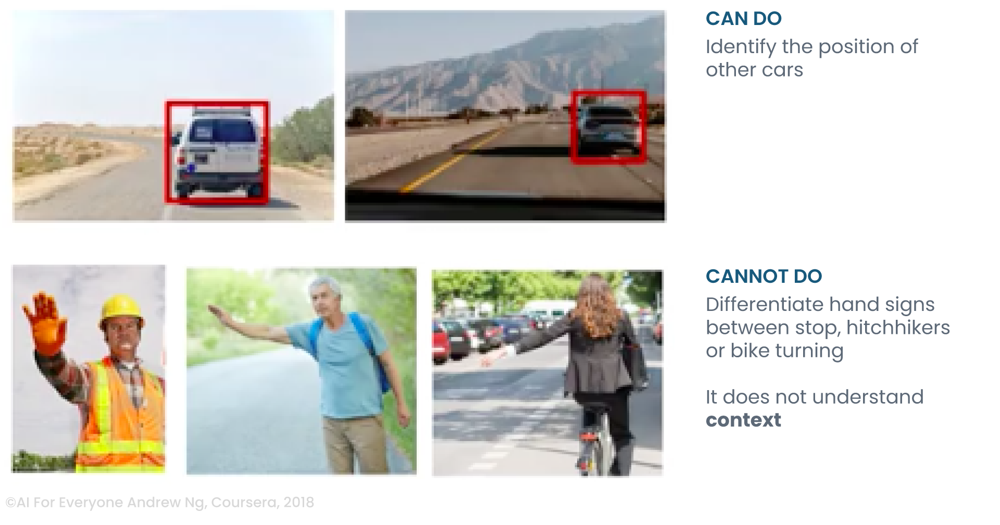

# AI Intro
> How can an AI system see the world?

**Learning objectives:** 
* Devlop familiarity with AI thinking 
* Identifying the different parts of training an AI :
* from building a data set of examples to testing the AI 

## 5 human senses
> How do babies learn what forks are: 5 human senses
<!-- ##### What is a fork? -->

    NOTES:
    * As kids, we learn to use a fork with our 5 senses
    * That way we experience the function of a fork

## Collect examples
> Let’s teach an AI what a fork is.  The first step would be to collect examples and identify forks in various images. 

    NOTES:
    To teach computers how to recognize a fork:   
    An AI trainer gathers a very large collection of examples (data set)
    This data set of images contains forks manually identified 
    The more examples we have the better the AI will work

## Input examples in your model
> Input examples and counter examples to train your model

    NOTES:
    * The AI trainer puts the collection of examples in the AI system.
    * The AI system can build a model of  what the forks look like from different angles.
    * The AI trainer puts another collection of counter examples of objects that are not forks.
    * That way the AI can see the difference between what a fork looks like and what a fork doesn’t look like.

## Test your model
> Test your model with another example, i.e. - a spoon

    NOTES:
    * The AI trainer runs a test to ensure the fork model works well and the AI is able to identify the images of forks.
    * We ask the AI if this image (the spoon) is a fork or not.

## Recap
> To problem solve with AI, build a model of what a fork looks like

    NOTES:
    * During the training, the AI found a common pattern in all of the images of forks.
    * The AI system built an internal model of what a fork looks like.

## Using AI
> Use your AI: identify a fork pattern!

    NOTES:
    * During the test, the AI takes an image and analyses it 
    to identify if a fork is included. 
    It starts by detecting the edges and identifying the pattern of a fork. 

## Machine Learning
> Machine learning is a technique that teaches computers to do what comes naturally to humans: **learn from experience.**

## Why is it so much work?
> Because your brain is really good at building models of objects

Your brain is really good at building models for objects and identifying them even if not all the parts of the objects are visible

## Self-driving cars
> Some things are obvious for us but remain difficult for AI

### CAN DO
* Identify the position of other cars

### CAN'T DO
* Differentiate hand signs between stop, hitchhikers or bike turning

## X-ray diagnosis
> AI flourishes with the input of large and high quality sets of data. 

### CAN DO
* Identify pneumonia from 10 000 labeled images

### CAN'T DO
* Identify pneumonia from 10 images, a textbook chapter and a few clinical cases

<ul style="color:#87CEFA;font-size:0.75rem;">
    <bold>References:</bold>
    <li> MIYAZAKI, H., et al. (2006). Hauru no ugoku shiro = Howl's moving castle. COLUMBUS, C. et al. (2001).</li>
    <li>Harry Potter And the Sorcerer's Stone. BIRD, B., et al. (2007). Ratatouille.</li>
    <li>Pexel</li>
    <li>The Matlab website</li>
    <li>Fork bent by James Rand. Spaghetti wound on a fork close-up by Marco Verch. DOCTER, P., et al. (2015)</li>.Inside Out.
    <li>Source AI For Everyone Andrew Ng, Coursera, 2018</li>
    <li>Eko Siswono Toyudho / Caters New, vox</li>
    <li>Pixabay, Lucasfilm Ltd. LLC‎</li>
    <li>Zack, Karen. “Chihuahua or Muffin ? Pic.twitter.com/LzZ1lwoVrP.” </li>
    <li>Twitter, Twitter, 10 Mar. 2016, twitter.com/teenybiscuit/status/707727863571582978.</li>
</ul>