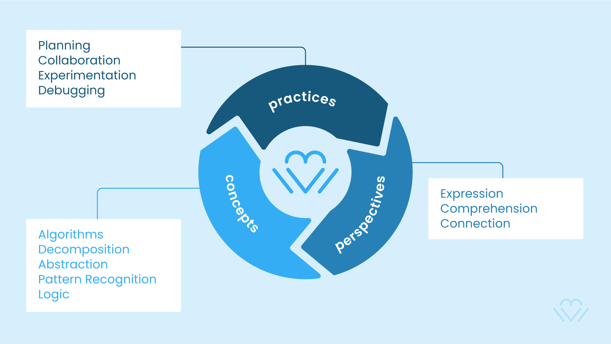
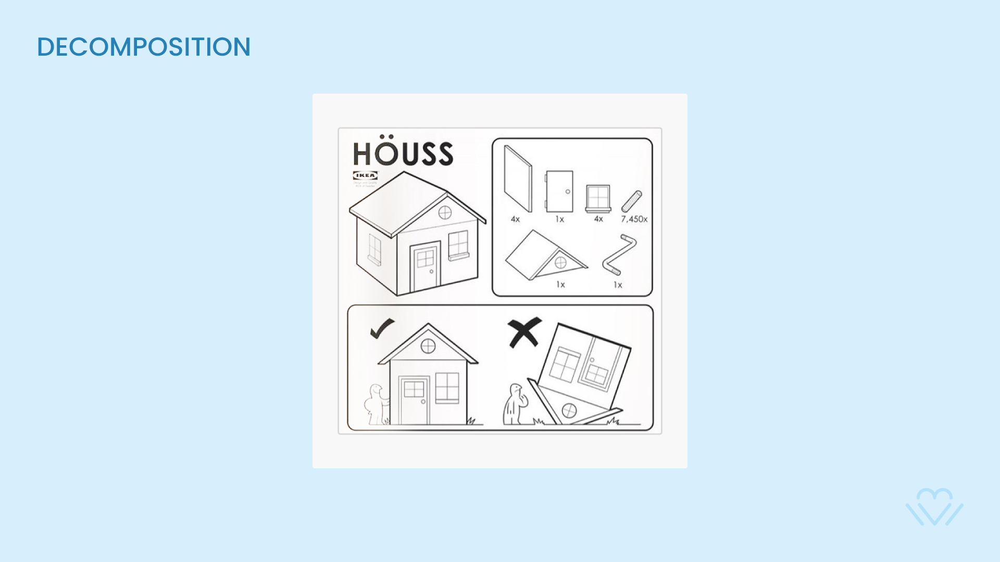
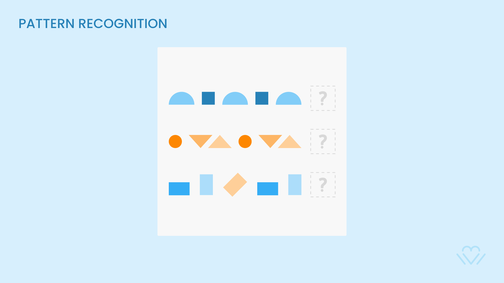
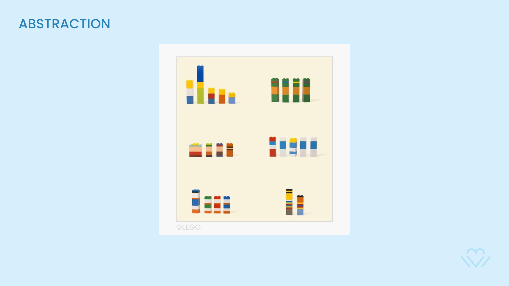
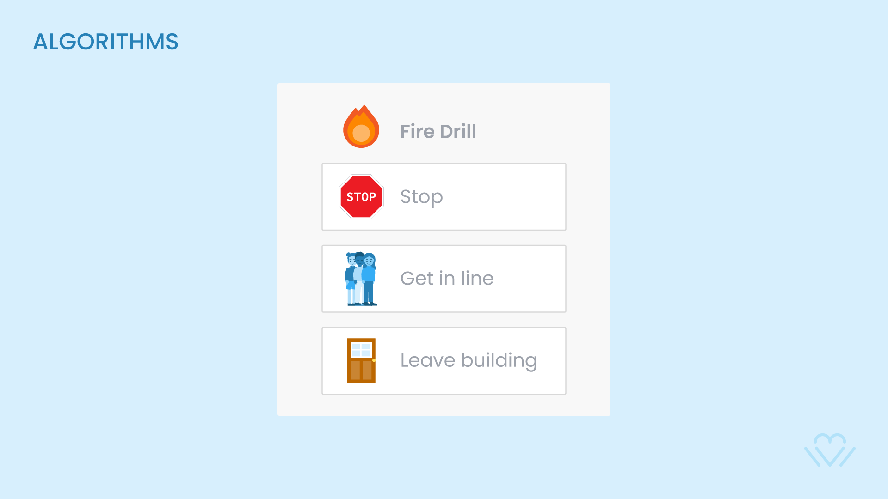
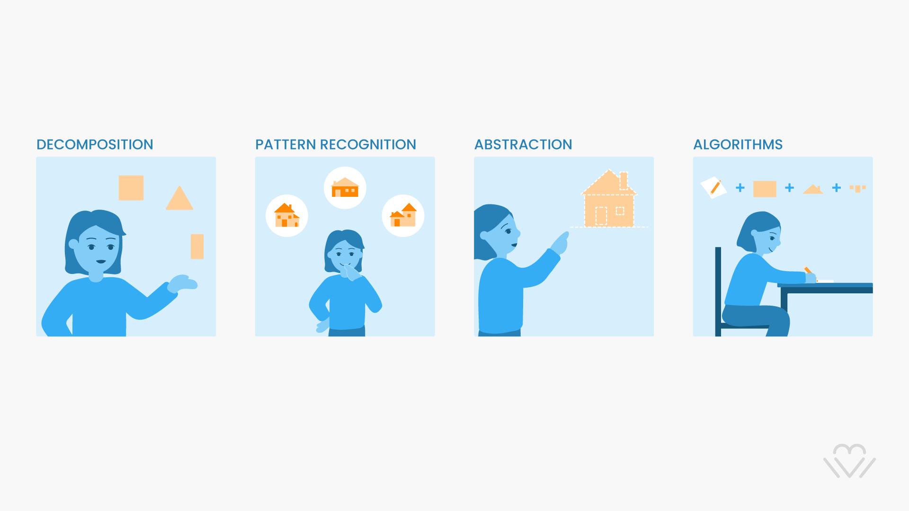
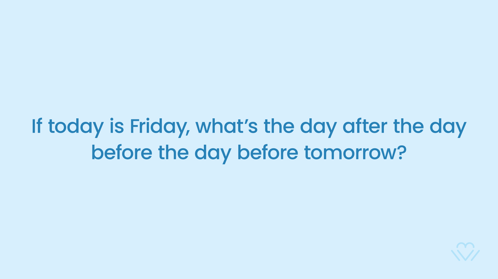
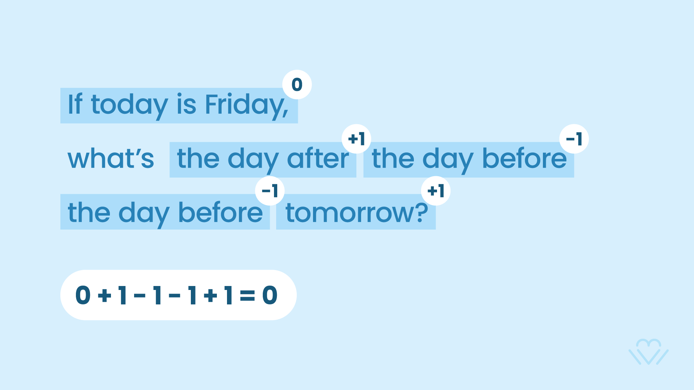

# Computational Thinking Intro

## Definition
> **When we formulate a problem or creative work clearly enough and systematically enough that we could tell a computer or a human how to do it**

## Decomposition
> **To reduce a complex problem into more simple pieces**

As educators, we use **Backwards Design** to work from an end goal when planning a learning experience, breaking a challenge into understandable, manageable parts.  

## Pattern Recognition
> **Looking for similarities or trends and being able to apply these to find solutions for similar problems**

Identifying and describing concrete patterns is an important component of **primary division Mathematics**. 

We work with students to help them predict the **next term** within a **pattern** and identify and define the **underlying pattern rule**. 

## Abstraction
> **Reducing something complex into the most essential characteristics**

When students learn about the **characteristics of text**, or the **attributes of a polygon**, or the **properties of a solid,liquid or gas**, they develop the ability to recognize and perceive abstractions. 

## Algorithms
> **A step-by-step list or sequence of instructions**

Frequently we encounter activities that need to be done in a specific, repeatable sequence, like a **recipe**. We practice **fire drills** in school to ensure that important steps are taken to ensure the safety during an evacuation.
The term **Procedural Thinking** can also be used to describe these processes. 

<strong>Notes</strong>
	<ul>
		<li>The world of recipes, lists and daily actions</li>
		<li>From waking up until sleep, we all live in our ‘daily algorithms’</li>
		<li>By constant iteration an algorithm becomes better with time</li>
	</ul>

## House Example
> **How would you explain computational thinking to your students?**

<strong>Notes</strong>
	<ul>
		<li>How would you explain computational thinking to your class in a simple way?</li>
		<li>How would you illustrate the use computational thinking through the action of drawing?</li>
	</ul>

## Text Challenge 
> **Let's apply our new computational thinking toolkit to solve a problem**

<strong>Notes</strong>
	<ul>
		<li>Apply the 4 strategies to find the solution</li>
		<li>Explain what strategies you have used to solve this problem</li>
	</ul>

<!--  -->

## Computational Thinking to Code
> **As we previously defined, Computational Thinking is the toolkit we use when we translate our human ideas into precise instructions for a computer to carry out. This set of instructions that we create is called ***CODE***.**.

## Papert to Scratch

> **The role of the teacher is to create the conditions of inventiveness rather than providing answers.**

<strong>Notes</strong>
	<ul>
		<li>Seymour Papert - a Jean Piaget alumnae - first invented LOGO</li>
		<li>LOGO is a programming language to teach kids about mathematics</li>
        <li>Later, one of his students Mitchel Resnick created Scratch</li>
        <li>Scratch is today’s standard to teach kids and adults how to code</li>
	</ul>

