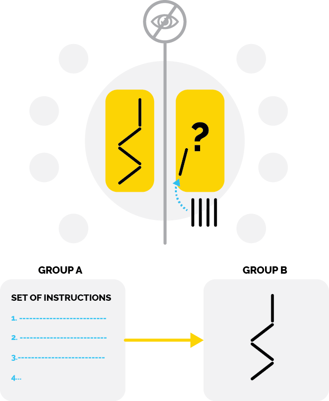

# Computational Thinking Unplugged
> Can you write instructions that are clear enough for a computer to understand?

**Recommended grade level:** Teachers and students of all levels

**Recommended duration:** 15 minutes

**Learning objectives:** 
* Devlop familiarity with the creation of a program
* Devlop familiarity with the programming concept of sequencing and algorithms
* To create clear and specific algorithms to perform a task or 'computation'

**Materials:**
* Popsicle sticks/pencils/stones (or any objects of similar size)
* Paper
* Markers

## Introduction 
> The Architect Game

This unplugged introductory game invites participants to experience what it is like **to be a programmer** by giving simple instructions to recreate an image. The instructions have to be as clear as possible in order to create an accurate image made with wooden sticks.

## Game Instructions

**1.** Divide students into teams of 2-4 people.

**2.** Invite each team to take 2 pieces of paper, markers and 5 sticks.

**3.** Explain and demonstrate that:

* Each team will work together to create a design with their sticks and draw it on a piece of scrap paper (see examples below).

* They should **not show** their design to the other teams.

**4.** Explain and demonstrate that:
* Without showing their designs, Team A will clearly instruct Team B to create their design. 

>For example, **“Place 3 sticks in a straight line from left to right.”**

	NOTES
	* Team A cannot point or demonstrate when they give instructions. 
	* They can only use words.
	* Team B might not follow the instructions correctly. 
	* If this happens, Team A can discuss ideas and try a new instruction.
	* A player from Team A will write down the instructions that work.
	* When the design is complete, change teams giving instructions.

**5.** Explain that each team has created instructions. They will give their written instructions to a new team (Team C) to follow.

**6.** Invite teams to see if Team C is able to create the design.

## Reflection

* Was it easy or challenging to give instructions?
* What were some of the challenges?
* In real life, what are some instructions that require measurements?
* What would happen if these instructions were not clear enough?
* When we give instructions, what do we need to do to ensure they lead to the desired result?
---

	TEACHING NOTES
	* Are all players able to share ideas and participate?
    * Can players give clear and effective instructions?
	* Are players becoming frustrated?