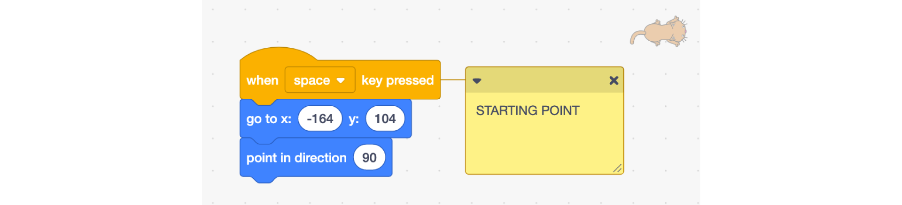
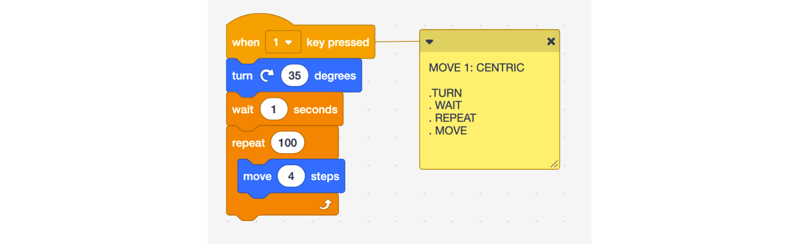
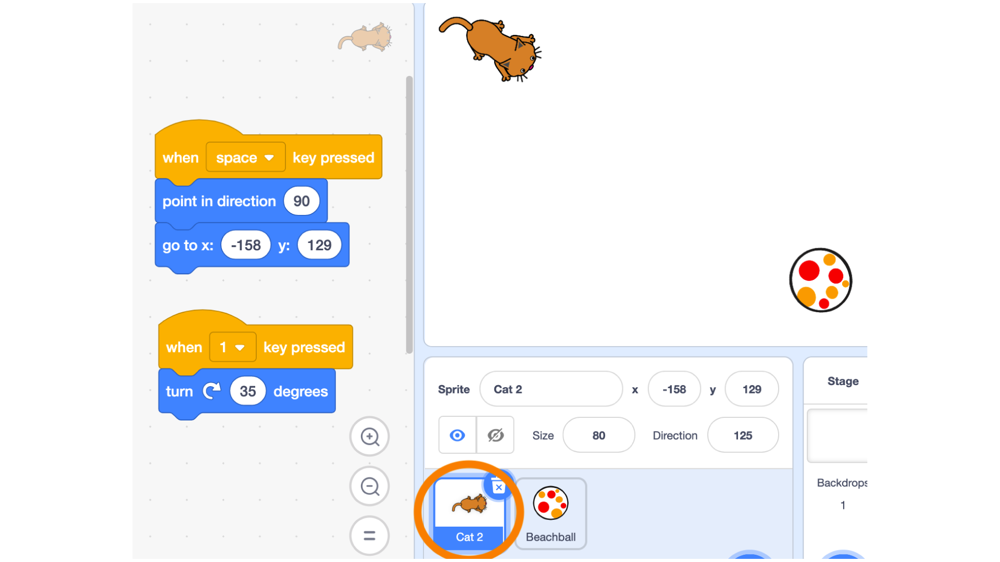
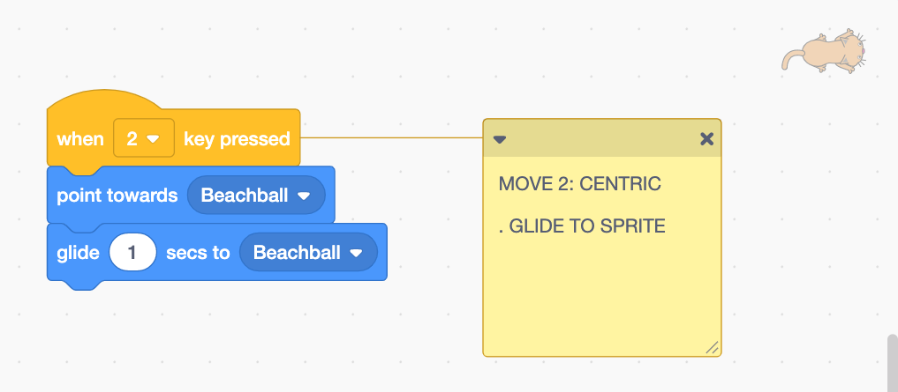
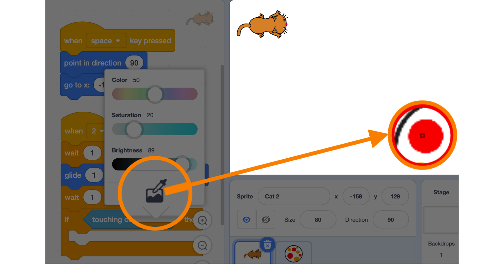
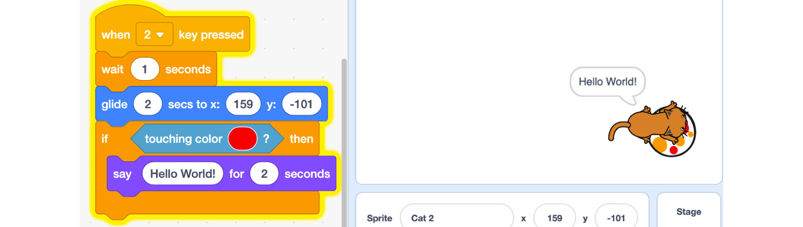
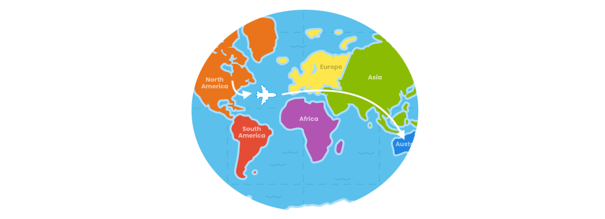

# Scratch Intro

Scratch is a programming language that allows you to use code blocks to create animations, stories, musical instruments, games, and much more. It's a bit like programming using Lego!

**EDITOR**

**TEACHER ACCOUNT:** [Creating a Scratch Account](https://scratch.mit.edu/educators/#teacher-accounts)

> To request an account as a teacher you will have to fill the following form and wait for 24h.

**EDUCATORS FAQ:** [Scratch FAQ](https://scratch.mit.edu/educators/faq)

## How to move in Scratch?

**Learning Objectives:**
* Familiarity with the Scratch environment
* Learn how to move using a centric system (like a GPS)
* Learn how to move using the cartesian system (XY coordinates)

**Recommended grade level:**: grades 3 - 7

**Recommended duration:**: 30 min.

**Materials:**: Scratch 3.0 platform

## Starting point

**1.** Select a sprite - Delete the default cat sprite, then click on Choose a Sprite (bottom right corner) and pick a sprite that you are looking at from above and that is facing towards the right. ***Ex: cat2, mouse1, beetle.***

> The first thing we do is to make sure we always have our sprite come back to a starting point whenever we choose. 

##### The first thing to do is to define your starting point:  We choose the top left side of the screen.

**2.** From the **Events** section, drag the **when ‘space’ key pressed** block into the coding area. This block will trigger your action and you may choose to customize the key being used by selecting it in the drop-down menu, 
**Ex: When ‘r’ key is pressed**

**3.** Move your sprite to the top left corner of the stage.  From the **Motion** section,  drag the **go to x: y:** block and the **point in direction 90** block into the coding area and attach them to the **when ‘space’ key pressed** block.

    NOTES
    * 0,0 is the center of the screen.
    * The scene dimensions are: -240 +240 on x and -180 +180 on y

**4.** **Choose a new sprite**  from the library and place it in the bottom right corner. 
***Ex: Beachball***

##### Clicking over the cat icon you can choose a new sprite, a ball in the example. 

    SPEKAER NOTES
    * Present the different parts of the scratch interface 
    * Present the drag and drop and how to delete a block
    * Explain how the x,y grid works in Scratch - (-240+240, -180+180)
    * Use the Rotation wheel to show properly how angles work in Scratch
    * Explain When key is pressed block show all the possibilities
    * Explain why the code is only added to the sprite when it is selected

## Centric moving
> Using the move, turn and repeat to reach your goal. 

##### We will use the event number 1 to activate the centric movement

**1.** In the Sprite section, **select** the cat (highlighted in blue) as we are going to be adding code to it.

**2.** From the **Events** section, drag the **when ‘space’ key pressed** into the coding area. Update the key so the event is triggered when the key ‘1’ is pressed. ***Ex. when ‘1’ key pressed***

**3.** From the **Motion** section, drag the **turn # degrees** block into the coding area, attach it to the **when ‘1’ key pressed** and adjust it to **35 degrees** so the cat aims towards the beach ball.

##### Make sure you have your sprite selected before starting to code

    NOTES
    *  As an alternative to the turn # degrees block:
    we could use the point towards block and select beach ball.

**4.** From the Motion section, drag the **move “10” steps** block into the coding area.

**5.** Adjusting the length of the movement so the first sprite (here the cat) gets to the second sprite (here the beach ball): 

* For the sprite to jump to another position: Adjust the number of steps in the **move “10” steps** block.
* For the sprite to move with a smooth motion: From the **Control** section, add the block **repeat 10** around the **move “10”** steps block. Then adjust the number of repeats and the number of steps.  
* To observe the different parts of motion: from the **Control** section, add the **wait ‘1’** seconds block after the **turn # degrees** block. Adjust the number of seconds to obtain different effects, this can be a decimal. ***Ex.wait ‘0.5’ seconds*** 

##### The block wait helps us to give timing to the code.

    SPEAKER NOTES
    * The "point towards" it's the easiest road for non-science teachers, 
    anything with angles is math and will be avoided if there's another option available.
    * Make sure to demonstrate the different options for moving: 400 steps vs. combination of repeat # and move # steps
    * Explain why we use a wait block between the turning and the moving

## Cartesian moving
> Learning to use XY coordinates (cartesian) and a condition to trigger an action.

##### We will use the event number 2 to trigger the cartesian movement

**1.** In the Sprite section, **select** the cat (highlighted in blue) as we are going to add more code to it.

**2.** From the **Events** section, drag the **when ‘space’ key pressed** into the coding area. Update the key so the event is triggered when the key ‘2’ is pressed. ***Ex. when ‘2’ key pressed***

**3.** From the **Motion** section, drag the **glide # secs to x: y:** block into the coding area. This block allows us to choose the point (x,y) we want to move to and how much time it will take to get there. In the **glide # secs to x: y:** block, update the XY coordinates to those of the destination (click on the beach ball to see its coordinates).

##### Use the glide block from the move section

**4.**  From the **Control** section, drag the **if/then** block into the coding area. This block allows us to check if a condition is being met (if the statement true or false).

**5.** **Say ‘Hello World” when the cat touches the ball** - From the **Sensing** section, drag the **touching color** block and add it into the **if/then** block in the empty space between the **‘if’**  and the **‘then’**. 

##### Use the touching color block under the Sensing section

**6.** Click on the **color** inside the **touching color block**, then use the **color picker tool** at the bottom to select the color red from the beach ball. The condition now becomes **if the cat  If ‘touching the red color is true’ then.**

##### Use the color picker to select the color you want to react from

**7.** From the **Looks** section, drag the **Say “Hello” for 2 seconds** block into the coding area and add it into the **if/then** block. Update the text so that it says **“Hello World!”**

##### Enjoy the final result: Hello World!

    SPEAKER NOTES
    * Explain the glide block, and how to get the beachball coordinate
    * Show what happens when we change the starting point

## Reflection
* Do you understand properly the two distinct ways to move in Scratch?
* Why would you choose one over the other and when?

## Remix

* [START HERE](https://scratch.mit.edu/projects/334022308/editor/)
* [SCRATCH STUDIO](https://scratch.mit.edu/studios/25252799/)

