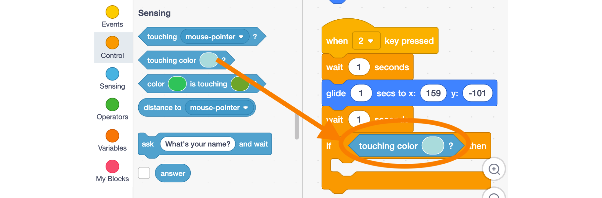

# Scratch Intro

Scratch is a programming language that allows you to use code blocks to create animations, stories, music, games, and much more. It's a bit like programming using Lego bricks!

**EDITOR**

> To request an account as a teacher you will have to fill the following form and wait 24 hours.

**TEACHER ACCOUNT:** [Creating a Scratch Account](https://scratch.mit.edu/educators/#teacher-accounts)

**EDUCATORS FAQ:** [Scratch FAQ](https://scratch.mit.edu/educators/faq)

## How to move your sprite in Scratch?

**Learning Objectives:**
* Develop familiarity with the Scratch environment
* Learn how to move using a centric system (like a GPS)
* Learn how to move using the cartesian system (X/Y coordinates)

**Recommended grade level:** grades 3 - 7

**Recommended duration:** 30 min.

**Materials:** Scratch 3.0 platform

<button style="width: 100%; padding: 20px; cursor: pointer; box-shadow: 6px 6px 5px; #999; -webkit-box-shadow: 2px 6px 5px #999; -moz-box-shadow: 6px 6px 5px #999; font-weight: bold; background: orange; color: white; border-radius: 10px; border: 0px solid #999; font-size: 150%;" onclick=" window.open('https://scratch.mit.edu/projects/334022308/editor/','_blank')">SCRATCH & REMIX</button>

## Starting point

**1.** **Select a sprite** - Delete the default cat sprite (drag it into the code area), then click on **Choose a Sprite** (bottom right corner) and pick a sprite that you are looking at from above, and that is facing towards the right. **Ex: cat2, mouse1, beetle.**

> The first thing we do is to make sure we always have our sprite come back to a starting point.

##### The first thing you should do is define your starting point: We choose the top left side of the screen.

**2.** From the **Events** section, drag a **when ‘space’ key pressed** block into the coding area. This block will trigger your action when the space bar of your keyboard is pressed.

**3.** From the **Motion** section, drag a **go to x: y:** block and a **point in direction ‘90’** block into the coding area and attach them to the **when ‘space’ key pressed** block.

**IMAGE HERE**

<strong>Notes</strong>
	<ul>
		<li>The coordinates (0, 0) are found at the center of the screen</li>
		<li>The scene dimensions are: -240/+240 on the x axis and -180/+180 on the y axis</li>
	</ul>

**4.** Choose a **new sprite**  from the library and place it in the bottom right corner. 
***Ex: Beachball***

##### Clicking over the cat icon you can choose a new sprite, a ball in the example. 

## Movement type 1 - Turn, Move & Repeat
> Centric movement: Use the move, turn and repeat blocks to reach your goal. 

##### We will use event number 1 to activate centric movement

**1.** In the **Sprite** section, **select your sprite** (highlighted in blue) 

**2.** From the **Events** section, drag a **when ‘space’ key pressed** block into the coding area. Select key ‘1’ from the dropdown menu: **when the key ‘1’ is pressed**. 

**3.** From the **Motion** section, drag a **turn ‘15’ degrees** block into the coding area, attach it to the **when ‘1’ key pressed** block and change it to **‘35’ degrees**, so the sprite turns towards the **beach ball**.

##### Make sure you have your sprite selected before starting to code

<strong>Notes</strong>
	<ul>
		<li>As an alternative to the <strong>turn # degrees</strong> block: we could use the <strong>point towards</strong> block and select beach ball.</li>
	</ul>

**4.** From the Motion section, drag a **move ‘10’ steps** block into the coding area.

**5.** Adjusting the length of the movement so **Sprite1 (cat)** gets to the **beach ball**:

* Solution 1: Adjust the number of steps in **move ‘10’ steps** block.
* Solution 2: From the **Control** section, drag a **repeat ‘10’** block and add it next to the **move ‘10’** steps block and adjust the number of repetitions.

**To add timing to the sequence:** from the **Control** section, drag a **wait ‘1’ seconds** block, add it after the **turn ‘35’ degrees** block. Adjust the number of seconds to create different effects, this can be a decimal. ***Ex.wait ‘0.5’ seconds***

##### The wait block helps us to give timing to the code.

<strong>Notes</strong>
	<ul>
		<li>Make sure to demonstrate the different options for moving: 400 steps vs. combination of repeat # and move # steps</li>
        <li>Explain why we use a wait block between the turning and the moving</li>
	</ul>

## Movement type 2 - Point toward & Glide to ‘Sprite’
> Use the Glide to ‘Sprite’ block to move around easily in the stage  

##### We will use the event number 2 to trigger the cartesian movement

**1.** In the **Sprite** section, select your sprite (highlighted in blue).

**2.** From the **Events** section, drag a **when ‘space’ key pressed** block into the coding area. Select key **‘3’** from the dropdown menu: **when the key ‘3’ is pressed.**

**3.** From the **Motion** section, drag a **Point towards ‘mouse-pointer’** block and **select ‘Beach ball’** from the drop down menu

**4.** From the **Motion** section, drag a **glide 1 secs to ‘Random position’** block and **select ‘Beach ball’** from the drop down menu

## Movement type 3 - Glide to X/Y coordinates 
> Learn to use X/Y coordinates (cartesian) and a condition to trigger an action.

##### We will use the event number 3 to trigger the cartesian movement

**1.** In the **Sprite** section, **select your sprite**. (highlighted in blue)

**2.** From the **Events** section, drag a **when ‘space’ key pressed** block into the coding area. Select key ‘3’ from the dropdown menu: **when the key ‘3’ is pressed**. 

**3.** From the **Motion** section, drag a **glide ‘1’ secs to x:# y:#** block into the coding area. This block allows us to glide to specific coordinates, **update** the **X/Y** to the **Beach ball coordinates**.

##### Use the glide X/Y block from the move section

**4.** From the **Control** section, drag a **if/then** block into the coding area. This block allows us to check if a condition is being met (if the statement is ‘true’ or ‘false’).

**5.** **Say ‘Hello World' when the cat touches the ball** - From the **Sensing** section, drag a **touching color** block and add it in the empty space between the **‘if’** and the **‘then’** of the **if/then** block.

##### Use the touching color block under the Sensing section

**6.** Click on the **color** inside the **touching color block**, then use the **color picker tool** (pipette) at the bottom to sample the **color red** from the **Beach ball.**

##### Use the color picker to select the color you want to react from

**7.** From the **Looks** section, drag a **Say “Hello” for 2 seconds** block, and add it between the branches of the **if/then** block. Update the text so that it says **“Hello World!”**

##### Enjoy the final result: Hello World!

<strong>Notes</strong>
	<ul>
		<li>Explain the glide block, and how to get the beachball coordinates</li>
        <li>Show what happens when we change the starting point</li>
	</ul>

## Reflection
* Do you understand the three distinct ways to move in Scratch?
* Why would you choose one over the other, and when?

## Remix

<button style="width: 100%; padding: 20px; cursor: pointer; box-shadow: 6px 6px 5px; #999; -webkit-box-shadow: 2px 6px 5px #999; -moz-box-shadow: 6px 6px 5px #999; font-weight: bold; background: orange; color: white; border-radius: 10px; border: 0px solid #999; font-size: 150%;" onclick=" window.open('https://scratch.mit.edu/projects/334022308/editor/')">SCRATCH & REMIX</button>

