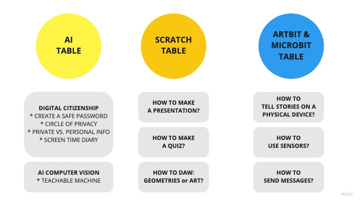

# Explorations Intro

**Learning Objectives:**
* Present the afternoon format of Explorations in general
* Show the ‘Explorations Map’ with the different tables and exercises.
* Explain which are the ‘Rules’ to follow. 
* They can only choose 2 tables ( 45min each).

**Recommended grade level:** Teachers first and second grade

**Recommended duration:**: 90 min

**Materials:**
* Makecode platform for Microbit ( Microbits )
* Art:bit platform for the Art:bit ( Ipads and Microbits )
* Scratch 3.0 platform for Scratch
* Ai related material
* Inspirational video example 
* Maybe some short examples of exercises made by teachers

**Table System:** ( Andy )
Assign tables randomly to facilitate collaboration.  Create color-coded name tags and participants sit at the table connected to their color.

**Introduction** ( Andy ):
Explorations is a chance to explore short activities and give you a chance to discuss how these skills could be brought into your classroom.
Use the time to discuss with your peers and keep in mind that you will need to fill out a form at the end to indicate how the connections might be made in your specific teaching context.

**Forms** ( Andy )

Build a form with specific  ‘strategic’ questions to help teachers make the right ‘curriculum’ connections with their own classes.

[Padlet](https://padlet.com/martha20/nqnoopjdto17)
[Form](https://docs.google.com/forms/d/e/1FAIpQLSf-vEHpdB3vQWxl0nFns8xA-mqRtBLUsvV4em47uemIgHLtpg/viewform?usp=sf_link)

* A specific concrete example connection.
* A more general example connection.
* Anything else we think it is important to add or collect data from.

