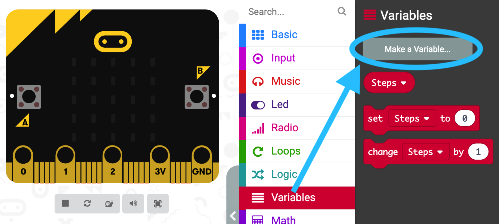
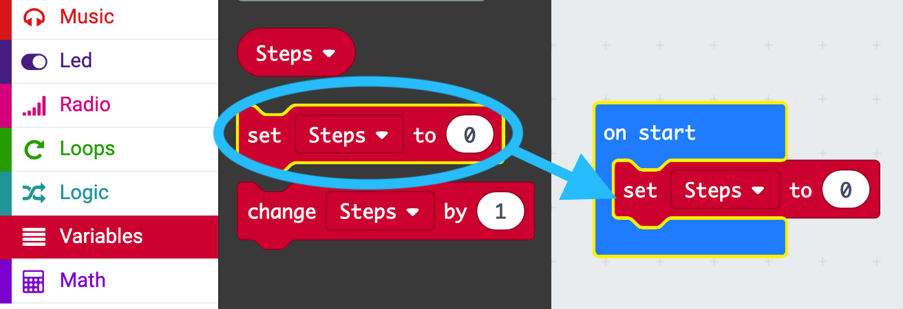
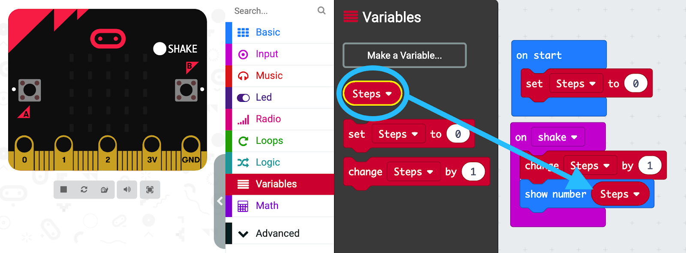
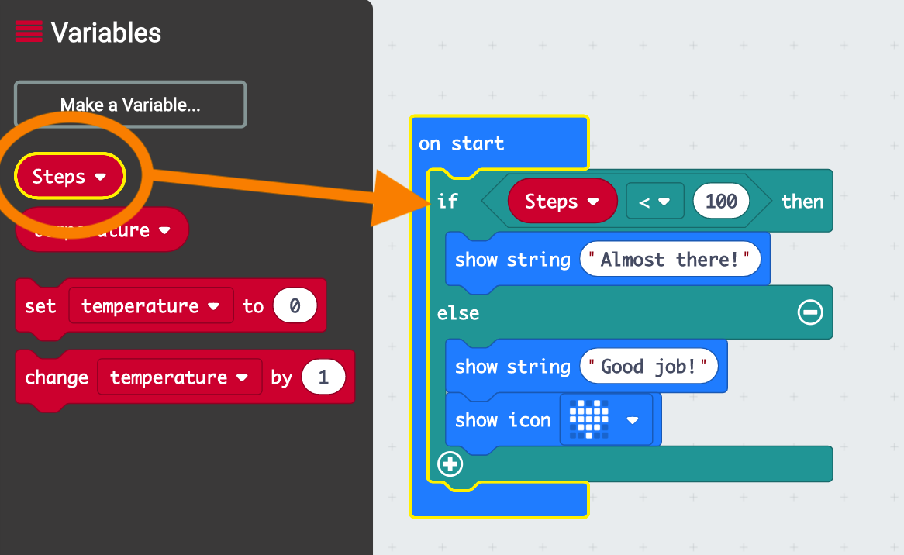
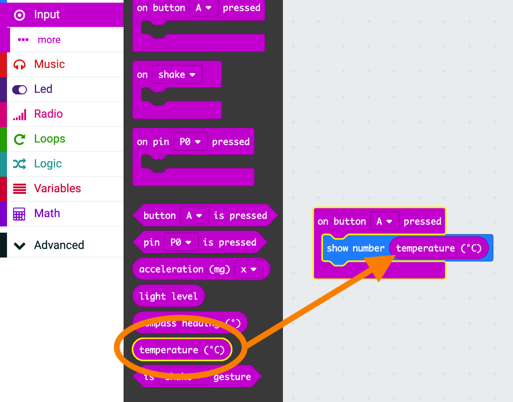
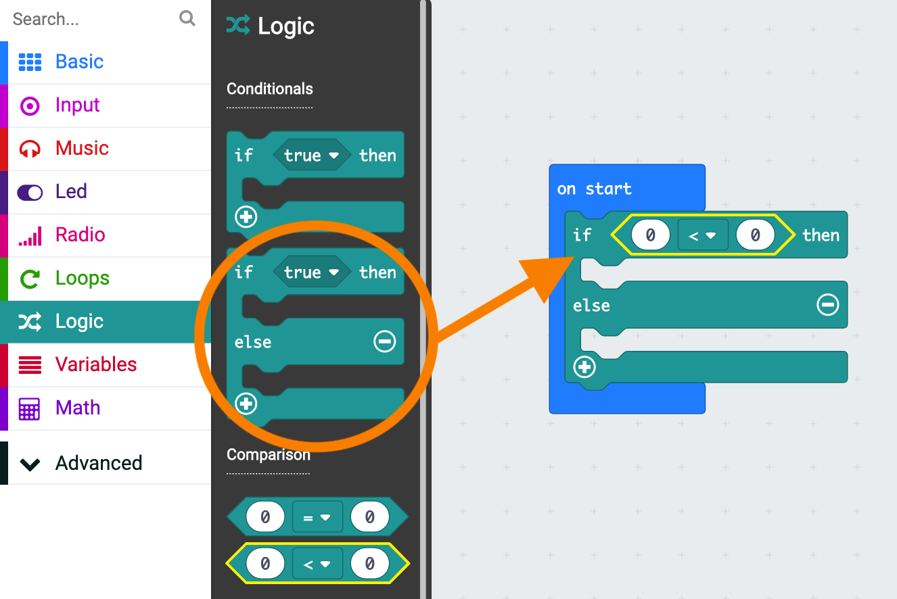
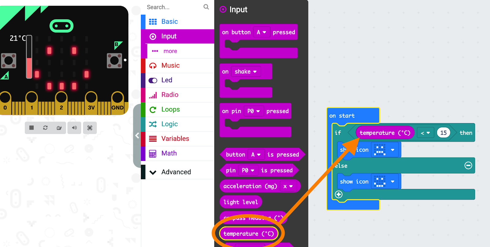

## Microbit Sensors
> Storytelling with code

**Learning Objectives:**
* Familiarity with physical computing through micro:bit 
* Familiarity with programming concepts: sequences, repetition, strings, and logic
* Familiarity with computational practices: planning and experimentation through the exploration of additional             * micro:bit features
    * Step counting
    * thermometer 

**Recommended grade level:**: grades 5 - 9

**Recommended duration:**: 30 min

**Materials:**

* Micro:bit 
* Computer 
* Projector 

## Step counter
> Build a step counter

**1.** Delete the two default blocks, **on start** and forever,  from the coding area.

**2.** **Create your counter** - In the **Variables** section, select **Make a Variable** and name it **Steps.**

**3.** **Initialize your counter**
* From the **Basic** section, drag the **on start** block into the coding area. 
* From the **Variables** section, insert the set **step to 0** block into the **on start** block.

**4.** **Count steps**
* From the **Input** section, drag the **on shake** block into the coding area.
* From the **Variables** section, drag the **change step by 1** block and insert it into the **on shake** block.
* From the **Basic** section, add the **show number** block immediately below the **change step by 1** block.
* From the **Variables** section, drag the **Steps** block and insert it into the **show number** block.

**Test your code**
* Online: click on the “shake” that appears on the image of the micro:bit
* Offline: Download your code to the micro:bit and shake it! LINK

**Activity Ideas**
* Scavenger Hunt: Estimate the number of steps from one clue to the next
* Stations with different activities(10 jumping jacks, 3 burpees, etc.): keep track of their counts with a micro:bit 
* Calorie counter: Multiply each step taken by the number of calories per step

## Extension

**Test whether you have taken 100 steps:**
* From the **Basic** section, drag the **on start** block into the coding area.
* From the **Logic** section, drag the **if “true” then /else** block into the **on start** block.
* From the **Logic** section, drag the comparison **less than (<)** block and insert it where the “true” is in the if “true” then /else block.
* From the **Variables** section, drag the **Steps** block and insert it on the left side of the **less than (<)** block so as to replace the ‘0’.
* In the **less than (<)** block, change the right hand ‘0’ to 100 for your test. 

**Action defined by number of recorded steps:**
* From the **Basic** section, drag two **show string** blocks into the coding area and insert them in the brackets of the **if “true” then /else** block. 
* Change the messages that will be displayed to ones that reflect what the result of the comparison is.
* Ex. when (Steps < 100) **Almost there!**
* Similarly, from the **Basic** section, you can add the **show icon** or **show leds** block and display the image or icon of your choice.

## Thermometer
> Build a thermometer

**1.** From the **Input** section, drag the block **on button A pressed** into the coding area. 

**2.** From the **Basic** section, drag the **show number** block into the coding area and insert in the **on button A pressed** section.

**3.** Display the temperature on your micro:bit - From the **Input** section, drag the **Temperature (°C)** block and insert it in the **show number** block.

## Extension
> Is it hot or cold?

**Test if the temperature is greater than 15°C :**

**1.** From the **Basic** section, drag the **on start** block into the coding area.
88
**2.** From the **Logic** section, drag the **if “true” then /else** block into the **on start** block.

**3.** From the **Logic** section, drag the comparison **less than (<)** block and insert it where the “true” is in the **if “true” then /else** block.

**4.** From the **Input** section, drag the **Temperature (°C)** block and insert it on the left side of the  **less than (<)** block so as to replace the ‘0’.

**5.** In the **less than (<)** block, change the right hand ‘0’ to 15 for your test. 

**Action defined by the recorded temperature:**

* From the **Basic** section, drag either two **show icon** blocks or two **show leds** bocks into the coding area and insert them in the brackets of the **if “true” then /else** block. 

* *Change the icons or draw the images that will indicate what the result of the comparison is
 ***Ex.  when temperature > 15 display a duck  < 15 display a house***

## Activity Ideas
* **Surface temperatures:** 
> Measure the temperature on black and white surfaces outdoors
* **Introducing climate change:** 
> Compare the temperature measured today with the average temperature over the last decade in your city
