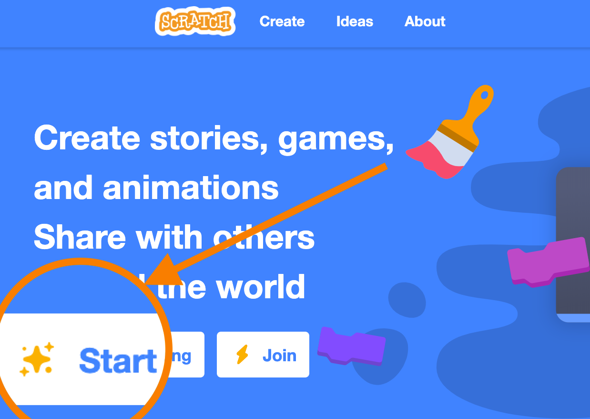

## Interactive presentation

**Recommended grade level:**: grades 3 - 9

**Recommended duration:**: 30 min.

**Learning Objectives:**
* Create an interactive presentation on a subject of your choice using Scratch. - [GLOBAL GOALS LINK](https://kidscodejeunesse.org/global-goals)
* Introduction to storytelling using Scratch
* Familiarity with the Scratch environment 

**Materials:**: Scratch 3.0

**Warm-up**
* If you already have a project you've done with the class, it's a great starting point (ex: arctic tundra, polar bear). - [GET INSPIRATION](http://www.hww.ca/en/ )
* Find some fun and interesting facts that you will then illustrate with characters in your project (ex: Polar bears have translucent hair and black skin to absorb and preserve body heat). - [GET INSPIRATION](http://www.hww.ca/en/)

## Remix
Click on this link to see an example of a project you can remix to make a similar project on the subject of your choice [LINK]()

## Build from Scratch

* Go to: [SCRATCH](https://scratch.mit.edu/) click on start creating

**1.** From the **event** section, drag an **event block** to trigger your action. Ex: **When ‘space’ key is pressed**

**2.** Move your sprite in the top left corner of the stage.  Drag a **go to x: y:** block and a **point in direction 90** block and attach them to your code

    NOTES
    * 0,0 is the center of the screen.
    * The scene dimensions are: -240 +240 on x and -180 +180 on y

**3.** **Choose a new sprite** the library and place it in the bottom right corner.

##### Clicking over the cat icon you can choose a new sprite, a ball in the example. 

    SPEKAER NOTES
    * Present the different parts of the scratch interface 
    * Present the drag and drop and how to delete a block
    * Explain how the x,y grid works in Scratch - (-240+240, -180+180)
    * Use the Rotation wheel to show properly how angles work in Scratch
    * Explain When key is pressed block show all the possibilities
    * Explain why the code is only added to the sprite when it is selected