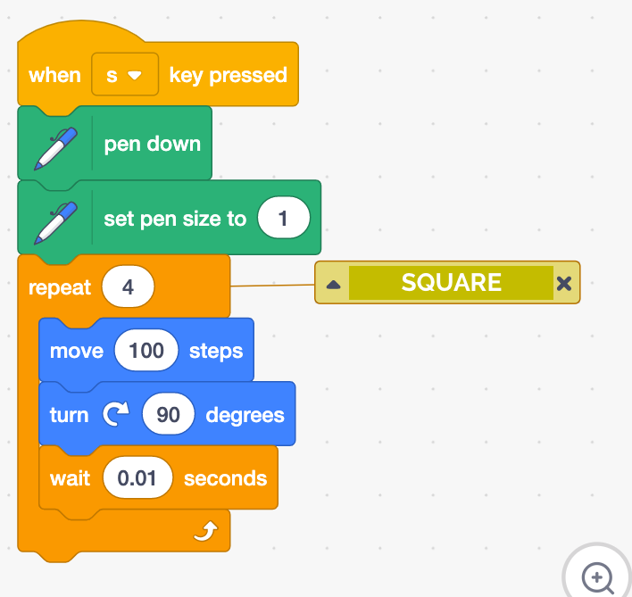

## Scratch Drawing

**Recommended grade level:**: grades 3 - 9

**Recommended duration:**: 30 min.

**Learning Objectives:**
* Familiarity with the essential Scratch drawing tools
* Curriculum connections with their Math and/or Art

**Materials:**: Scratch 3.0

## Remix
Click on this link to see an example of a project you can remix to make a similar project on the subject of your choice :

* [START HERE](https://scratch.mit.edu/projects/325766838/)
* [SCRATCH STUDIO](https://scratch.mit.edu/studios/25123810/)

## Build from Scratch

* Go to: [SCRATCH](https://scratch.mit.edu/) click on start creating

## Set up

 **1.** **Choose your sprite** - Choose the sprite you want to draw your shape with from the library (we suggest using an arrow to help visualize changes in direction).

**2.** Click on the lower left-hand corner **extension** symbol

**3.** **Add the drawing extension** - Select the **PEN** extension which make the **PEN blocks** available at the bottom of your Block palette. 

**4.** **Create a blank canvas** - From **Events**, drag a **when a space is clicked** block in the coding area. Drag an **erase all** block and add it to your code.

**5.** **Define your reset button** - Move your sprite to the position you want it to start at and use a **go-to x: y:** from the **motion** section and a **point in the direction 90**.

## Draw a Square
> Learn how to draw a square

* From the **event** section, drag an **event block** to trigger your action. Ex: **When‘s’ key is pressed**

* **Draw** - to draw add a **pen down** block to your code 

* From the **motion** section drag a move block and a turn block adjust the steps to be 200 and the angle to be 90°

* **Repeat** - from the **control** section drag a repetition block and insert it around the move and turn block. Adjust the repetition number to draw a square. 

* Your first drawing of a square with code!

## Extension challenge
> draw a circle and a hexagon

        NOTE
        * You can draw a Mandala by putting an extra loop over the code 
        of a geometric shape to repeating 

### Experiment with other blocks ###

* Change the **color** and **thickness** of your square by using these blocks in your code

        NOTE
        * There are 200 colors and each one has a number. 
        If we start at 0 (red) and change the pen color by 10, 
        as it moves through the loop, 
        we can get a good sense of what they are. 

## Create a drawing machine
> Create a never-ending drawing machine

* **Update your reset button** - Change the angle of your reset button to be different than 90° so that your machine doesn’t only draw a horizontal straight line.

* From the **event** section, drag an **event block** to trigger your action. Ex: **When ‘d’ key is pressed.** 
* From the pen section, use a block **pen down** to start drawing 
* From the **control** section use a forever repetition block (so that your machine never stops)
* From the **motion** section drag a **move 10 steps** and an **if on edge bounce** and place it inside the forever loop.

* You can also add a block **change pen color** to change the colors!

